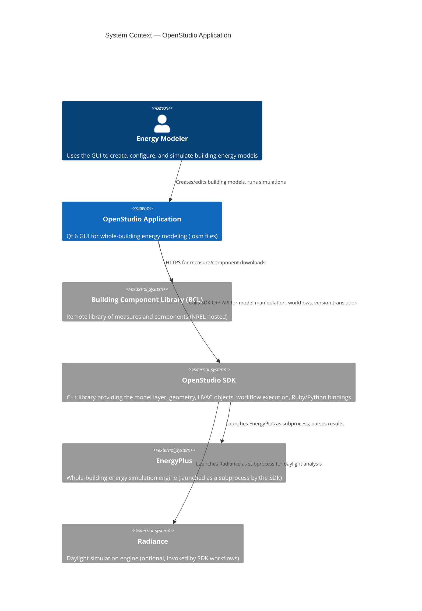
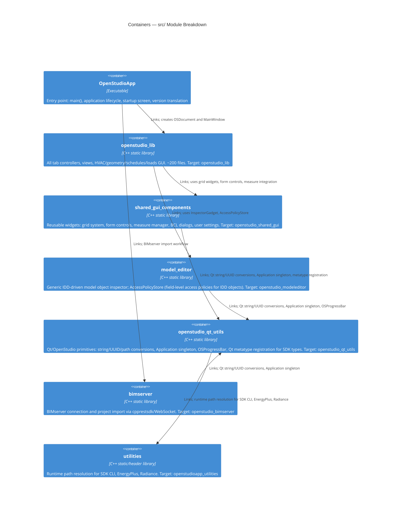
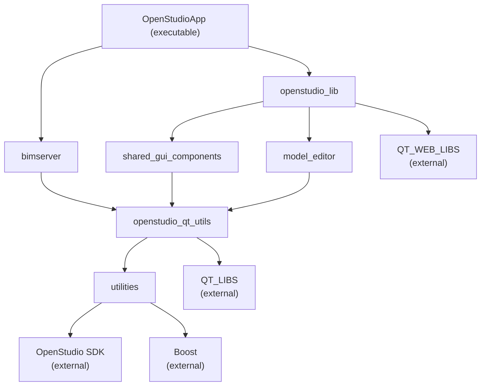

# OpenStudio Application — Architecture Overview

> **Version:** 1.11.0  
> **Audience:** Internal team (C++/Qt familiarity assumed)  
> **Last updated:** See git log  

## Contents

1. [Project Purpose](#1-project-purpose)
2. [System Context](#2-system-context)
3. [Module Containers](#3-module-containers)
4. [Module Dependency Graph](#4-module-dependency-graph)
5. [Technology Stack](#5-technology-stack)
6. [Build & Toolchain](#6-build--toolchain)
7. [Key Architectural Patterns](#7-key-architectural-patterns)
8. [CI/CD Overview](#8-cicd-overview)
9. [Module Index](#9-module-index)

---

## 1. Project Purpose

The **OpenStudio Application** is a cross-platform (Windows, macOS, Linux) graphical user interface for whole-building energy modeling. It provides a Qt 6 GUI on top of the **[OpenStudio SDK](https://github.com/NREL/OpenStudio)** (NREL), which in turn drives EnergyPlus simulations and Radiance daylighting analysis.

Users model building envelopes, thermal zones, HVAC systems, loads, schedules, geometry, and OpenStudio Measures through a tab-based interface. The application is maintained by the **OpenStudio Coalition** and is fully open source.

Key user workflows:
- Open/create/save `.osm` (OpenStudio Model) files
- Configure building geometry, constructions, loads, schedules, and HVAC
- Apply scripted transformations (OpenStudio Measures) via BCL or local directories
- Run EnergyPlus simulations and review results

---

## 2. System Context



---

## 3. Module Containers

Each subdirectory under `src/` is compiled as a separate CMake library target. The application executable links them together.



---

## 4. Module Dependency Graph



---

## 5. Technology Stack

| Layer | Technology | Version | Role |
|---|---|---|---|
| GUI framework | **Qt** | ≥6.5.2 | Widgets, WebEngine, Charts, Network, Svg, QML |
| Core model | **OpenStudio SDK** | matched per release | Building model objects, IDF/OSM I/O, workflows, EnergyPlus bridge |
| Simulation engine | **EnergyPlus** | bundled with SDK | Whole-building energy simulation (subprocess) |
| Language | **C++** | C++20 | All application source code |
| Scripting | **Ruby** | 3.2.2 | Measures, CLI scripting, language bindings |
| Scripting | **Python** | 3.x | Measures, CLI scripting, language bindings |
| Build | **CMake** | ≥3.10.2 + Presets | Build configuration, CPack packaging |
| Package mgmt | **Conan 2** | 2.x | C++ dependency management |
| General utils | **Boost** | 1.79 | Optional, smart_ptr, filesystem |
| XML | **pugixml / libxml2 / libxslt** | system | XML parsing |
| JSON | **jsoncpp** | 1.9.5 | JSON serialization |
| Formatting | **fmt** | 9.1.0 | String formatting |
| Database | **SQLite3** | system | Local results database |
| 3D geometry | **TinyGLTF** | — | GLTF import/export |
| Language bindings | **SWIG** | 4.1.1 | Ruby/Python binding generation |
| Compiler cache | **ccache / sccache** | any | CI build acceleration |

---

## 6. Build & Toolchain

The project uses **CMake Presets** with **Conan 2** for reproducible builds across platforms.

### Quick Start

```bash
# 1. Install Conan 2, CMake ≥3.10.2, Qt 6.5.2 (via aqtinstall), compiler
# 2. Add NREL Conan remote
conan remote add -f nrel-v2 http://conan.openstudio.net/artifactory/api/conan/conan-v2

# 3. Install dependencies
conan install . --output-folder=../OSApp-build-release --build=missing \
  -c tools.cmake.cmaketoolchain:generator=Ninja \
  -s compiler.cppstd=20 -s build_type=Release

# 4. Configure CMake using the generated preset
cmake --preset conan-release -DQT_INSTALL_DIR:PATH=/path/to/Qt/6.x.x/<platform>

# 5. Build
cmake --build --preset conan-release --target package
```

See [BUILDING.md](../../BUILDING.md) for the complete, platform-specific instructions.

### CMake Targets

| Target | Type | Description |
|---|---|---|
| `OpenStudioApp` | Executable | Main application binary |
| `openstudio_lib` | Static library | Tab GUI library |
| `openstudio_shared_gui` | Static library | Reusable widget library |
| `openstudio_modeleditor` | Static library | Generic IDD-driven model inspector |
| `openstudio_qt_utils` | Static library | Qt/OpenStudio primitives: string/UUID/path conversions, `Application` singleton, `OSProgressBar`, Qt metatype registration for SDK types |
| `openstudioapp_utilities` | Static library | Runtime path helpers |
| `package` | CPack | Platform installer (`.exe`/`.dmg`/`.deb`/`.tar.gz`) |

### Platform Packaging

| Platform | Installer format | Archive |
|---|---|---|
| Windows | `.exe` (Qt IFW) + SignPath code signing | `.zip` |
| macOS | `.dmg` (Qt IFW) + Apple notarization | `.tar.gz` |
| Linux (Ubuntu 22/24) | `.deb` | `.tar.gz` |

---

## 7. Key Architectural Patterns

### 7.1 Tab-Based Master-Detail Pattern

Each major domain (HVAC, Schedules, Constructions, Geometry, etc.) follows a three-class pattern. The **Model** role is played by the OpenStudio SDK model objects (`openstudio::model::Model` and its children); the controller mediates between those objects and two views:

```mermaid
classDiagram
  class MainTabController {
    +mainContentWidget() MainTabView*
    +setSubTab(int index)
    signals: modelObjectSelected, dropZoneItemSelected, toggleUnitsClicked
  }
  class MainTabView {
    +setSubTab(QWidget*)
    +showDropZone(bool)
  }
  class InspectorWidget {
    +update(ModelObject)
  }
  class OpenStudio::ModelObject {
    <<OpenStudio SDK>>
  }
  MainTabController "1" --> "1" MainTabView : owns
  MainTabController "1" --> "0..1" InspectorWidget : controls
  MainTabController --> ModelObject : reads / mutates
  InspectorWidget --> ModelObject : reads / mutates
  note for MainTabController "Each domain derives from MainTabController\ne.g. HVACSystemsTabController"
```

This is a **master-detail** variant of MVC: `MainTabView` is the master (list or primary content area) and `InspectorWidget` is the detail panel shown in the right column when an object is selected. Views do observe model changes — `ModelObjectListView` connects directly to `OSAppBase::workspaceObjectAddedPtr` / `workspaceObjectRemovedPtr`, which are Qt signals re-broadcast from the SDK model. `OSAppBase` acts as a model-change event bus shared across the application.

The derived tab controller (e.g., `HVACSystemsTabController`) creates the domain-specific view, handles user actions, mutates the SDK model objects, and refreshes the inspector panel accordingly.

### 7.2 OSVectorController / Drop Zone Pattern

List-based views (material layers, zone equipment, schedule day segments) use `OSVectorController` as a base:

- `OSVectorController::makeVector()` — returns the current set of `OSItemId`s from the model
- Items are displayed as `OSItem` widgets inside an `OSItemList` or `OSDropZone`
- User drops/removes trigger signals routed back through the controller to modify the model

### 7.3 Grid System

Multi-column tabular views (Thermal Zones, Space Types, Spaces, Facility) use:
- `OSGridController` — base class mapping model objects to rows and defining columns via typed concept functions (`addCheckBoxColumn`, `addComboBoxColumn`, `addDoubleEditColumn`, etc.)
- `OSGridView` — QWidget rendering the grid; reuses `OSCellWrapper` per cell
- `OSObjectSelector` — manages row selection state

### 7.4 Qt WebEngine Geometry Bridge

The Geometry tab uses a Qt WebEngine page (`GeometryEditorView`) to display and edit 3D building geometry via a JavaScript/C++ bridge:
- `OSWebEnginePage` subclasses `QWebEnginePage` and exposes a C++ API to the embedded JavaScript engine
- 3D data is transferred as GLTF (via TinyGLTF) serialized to JSON
- User interactions in the web view (select surface, drag vertex) emit Qt signals consumed by `GeometryEditorController`

### 7.5 Measure / BCL Integration

OpenStudio Measures (Ruby or Python scripts that transform models) are managed by `MeasureManager`:
- Scans local `myMeasures`, `BCL` directories; deduplicates by UUID
- Exposes a measure browser via `LocalLibraryController`/`BCLMeasureDialog`
- Runs measures via the OpenStudio CLI in a background process
- The `ApplyMeasureNowDialog` provides a modal UI for running a single measure interactively

### 7.6 Library Boundary Rules

The intended dependency order is strict and acyclic:

```
OpenStudioApp (exe)
  → openstudio_lib
    → shared_gui_components
      → openstudio_qt_utils
        → openstudioapp_utilities
  → openstudio_bimserver
    → openstudio_qt_utils
  → openstudio_modeleditor
    → openstudio_qt_utils
```

**The `BaseApp` interface** (`shared_gui_components/BaseApp.hpp`) is the key boundary between the lower-level `shared_gui_components` library and the upper-level `openstudio_lib` library. All `shared_gui_components` code that needs application-level services must go through `BaseApp`, never through `OSAppBase`, `OSDocument`, or `MainWindow` directly.

**Known violations (tracked as tech debt):**

| Violation | Location | Correct Fix |
|---|---|---|
| `OSItem`, `OSDropZone`, `ModelObjectItem` live in `openstudio_lib` but are included by `shared_gui_components` code (`OSCellWrapper`, `OSGridView`, `OSWidgetHolder`, `OSLineEdit`, `OSGridController`, `LocalLibraryController`) | `src/openstudio_lib/OSItem.hpp`, `OSDropZone.hpp`, `ModelObjectItem.hpp` | Move these three classes to `shared_gui_components`; they have no `openstudio_lib`-only dependencies. `OSItem` depends only on `OSItemId` and `LocalLibrary.hpp`, both already in `shared_gui_components`. |

---

## 8. CI/CD Overview

Two parallel CI systems are used:

| System | Trigger | Purpose |
|---|---|---|
| **GitHub Actions** | PR + push to master/develop + version tags | Full 5-platform build matrix, code signing, release publishing, static analysis, CLA enforcement |

See [ci/overview.md](ci/overview.md) for the full CI/CD architecture documentation, or browse individual workflow docs under [ci/workflows/](ci/workflows/).

---

## 9. Module Index

| Module | Library Target | Doc |
|---|---|---|
| `src/openstudio_app/` | `OpenStudioApp` (exe) | [libraries/openstudio_app.md](libraries/openstudio_app.md) |
| `src/openstudio_lib/` | `openstudio_lib` | [libraries/openstudio_lib.md](libraries/openstudio_lib.md) |
| `src/shared_gui_components/` | `openstudio_shared_gui` | [libraries/shared_gui_components.md](libraries/shared_gui_components.md) |
| `src/bimserver/` | `openstudio_bimserver` | [libraries/bimserver.md](libraries/bimserver.md) |
| `src/model_editor/` | `openstudio_modeleditor` | [libraries/model_editor.md](libraries/model_editor.md) |
| `src/openstudio_qt_utils/` | `openstudio_qt_utils` | [libraries/openstudio_qt_utils.md](libraries/openstudio_qt_utils.md) |
| `src/utilities/` | `openstudioapp_utilities` | [libraries/utilities.md](libraries/utilities.md) |
