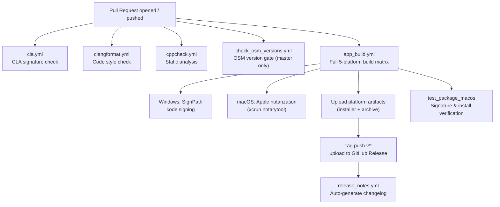
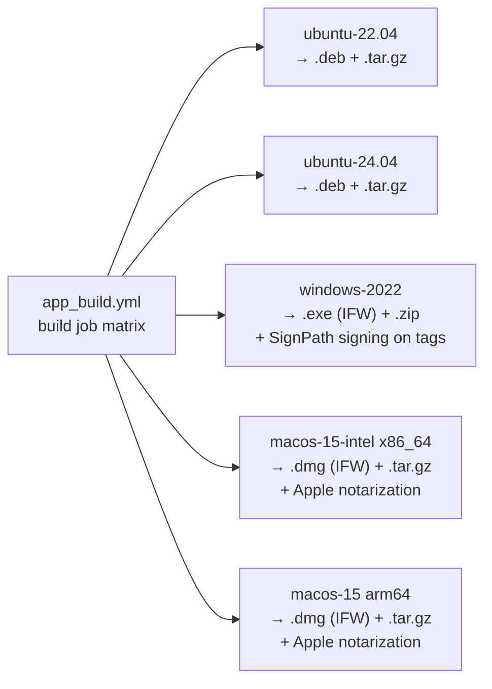

# CI/CD Architecture Overview

> **Back to:** [Architecture Overview](../architecture.md)

## Contents

1. [System Overview](#1-system-overview)
2. [End-to-End Pipeline](#2-end-to-end-pipeline)
3. [Build Matrix](#3-build-matrix)
4. [Workflow Index](#4-workflow-index)
5. [Jenkins Pipelines](#5-jenkins-pipelines)
6. [GitHub Secrets](#6-github-secrets)
7. [CI Helper Scripts](#7-ci-helper-scripts)
8. [CMake Code-Signing Modules](#8-cmake-code-signing-modules)

---

## 1. System Overview

The project uses **two parallel CI systems**:

| System | Triggers | Purpose |
|---|---|---|
| **GitHub Actions** | PR (all), push to `master`/`develop`, `v*` tags, manual dispatch | Full 5-platform build matrix, static analysis, CLA, code style, release publishing |
| **Jenkins** (NREL internal, `cbci_shared_libs`) | PR builds only (`CHANGE_ID` set) | Incremental build checks on NREL infrastructure |

GitHub Actions is the **primary** CI system. Jenkins provides supplemental incremental builds for NREL contributors.

---

## 2. End-to-End Pipeline

---

## 3. Build Matrix

---

## 4. Workflow Index

| Workflow | Trigger | Purpose | Doc |
|---|---|---|---|
| `app_build.yml` | Push master/develop, PR, tags | Main 5-platform build, sign, package, release | [workflows/app_build.md](workflows/app_build.md) |
| `check_osm_versions.yml` | PR → master | Validates OSM version translation | [workflows/check_osm_versions.md](workflows/check_osm_versions.md) |
| `cla.yml` | PR events + `issue_comment` | CLA signature enforcement | [workflows/cla.md](workflows/cla.md) |
| `clangformat.yml` | PR → master/develop | C++ code style enforcement | [workflows/clangformat.md](workflows/clangformat.md) |
| `cppcheck.yml` | Push master, PR | Static analysis | [workflows/cppcheck.md](workflows/cppcheck.md) |
| `export_standards_data.yml` | Manual dispatch | Export SDK standards data and commit OSMs | [workflows/export_standards_data.md](workflows/export_standards_data.md) |
| `manual_cli_test.yml` | Manual dispatch | 5-platform CLI smoke tests | [workflows/manual_cli_test.md](workflows/manual_cli_test.md) |
| `release_notes.yml` | Release `created` | Auto-generate changelog from GitHub issues | [workflows/release_notes.md](workflows/release_notes.md) |

---

## 5. Jenkins Pipelines

Three Jenkinsfiles are provided for NREL's internal Jenkins infrastructure. Each delegates entirely to a **shared library** at `github.com/NREL/cbci_jenkins_libs`:

| File | Library function |
|---|---|
| `Jenkinsfile_linux` | `openstudio_app_incr_linux()` (branch: `@updateLibs`) |
| `Jenkinsfile_osx` | `openstudio_app_incr_osx()` |
| `Jenkinsfile_windows` | `openstudio_app_incr_windows()` |

**Trigger condition:** all three pipelines run only when both `env.CHANGE_ID` and `env.CHANGE_TARGET` are set — meaning **PR builds only**. Pushes to branches are handled exclusively by GitHub Actions.

See [jenkins.md](jenkins.md) for further details.

---

## 6. GitHub Secrets

| Secret | Used by | Purpose |
|---|---|---|
| `MACOS_DEVELOPER_ID_APPLICATION_CERTIFICATE_P12_BASE64` | `app_build.yml` | Base64-encoded P12 cert for macOS app bundle signing |
| `MACOS_DEVELOPER_ID_INSTALLER_CERTIFICATE_P12_PASSWORD` | `app_build.yml` | Password for the macOS installer signing P12 |
| `MACOS_KEYCHAIN_PASSWORD` | `app_build.yml` | Password for the temporary keychain created during macOS CI |
| `NOTARIZATION_API_KEY` | `app_build.yml` | Apple App Store Connect API key for `xcrun notarytool` |
| `NOTARIZATION_API_TEAM_ID` | `app_build.yml` | Apple Team ID for notarization |
| `NOTARIZATION_API_ISSUER_ID` | `app_build.yml` | Issuer ID for App Store Connect API |
| `SIGNPATH_CI_TOKEN` | `app_build.yml` | Windows code signing token via SignPath |
| `ANALYTICS_API_SECRET` | `app_build.yml` | Google Analytics Measurement Protocol secret embedded in the app binary |
| `ANALYTICS_MEASUREMENT_ID` | `app_build.yml` | Google Analytics measurement ID |
| `CLA_SECRET` | `cla.yml` | Personal access token for cla-assistant GitHub Action |
| `CACHE_KEY` | `app_build.yml` | Rotatable opaque key for invalidating all CI caches |

---

## 7. CI Helper Scripts

See [scripts.md](scripts.md) for full documentation of all scripts in `ci/`.

| Script | Purpose |
|---|---|
| `ci/clang-format.sh` | Runs clang-format on PR-changed files; produces patch |
| `ci/pre-commit.sh` | Git pre-commit hook wrapping clang-format |
| `ci/colorize_cppcheck_results.py` | ANSI-colorizes cppcheck output by severity |
| `ci/install_script_qtifw.qs` | Silent QtIFW installer controller for CI |
| `ci/parse_cmake_versions.py` | Extracts version variables from CMake files |

---

## 8. CMake Code-Signing Modules

| File | Purpose |
|---|---|
| `CMake/CodeSigning.cmake` | `codesign` and `xcrun notarytool` helper CMake functions |
| `CMake/CPackSignAndNotarizeDmg.cmake` | CPack post-build hook: signs and notarizes the `.dmg` |
| `CMake/install_codesign_script.cmake` | CMake install-time signing (all components) |
| `CMake/install_codesign_script_OpenStudioApp.cmake` | Signing script scoped to the `OpenStudioApp` component |
| `CMake/install_codesign_script_Python.cmake` | Signing script scoped to the Python bundle component |
| `FindOpenStudioSDK.cmake` | Defines `OPENSTUDIO_VERSION_*` variables consumed by version parser script |
