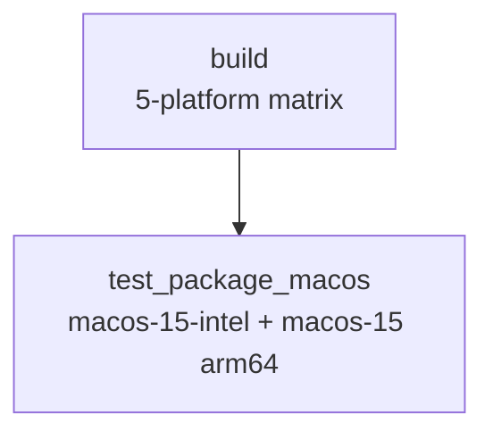

# Workflow: `app_build.yml` — Main Build Pipeline

> **File:** `.github/workflows/app_build.yml`  
> **Back to:** [CI/CD Overview](../overview.md)

## Purpose

The primary CI workflow. Builds the OpenStudio Application on 5 platforms, runs tests and benchmarks, applies code signing (on tags), and uploads installers to GitHub Releases.

---

## Trigger

```yaml
on:
  push:
    branches: [master, develop]
    tags: ['v*']
  pull_request:
    types: [opened, reopened, synchronize, ready_for_review]
    branches: [master, develop]
```

Draft PRs are skipped via an `if: github.event.pull_request.draft == false` guard.

---

## Jobs



---

## `build` Job — Step Sequence

```mermaid
flowchart TD
  CO["Checkout (actions/checkout@v4)"] --> PY["Setup Python 3.12"]
  PY --> RB["Setup Ruby 3.2.2"]
  RB --> VER["Parse versions\n(ci/parse_cmake_versions.py)"]
  VER --> PLATFORM["Platform-specific setup\n(apt / choco / brew)"]
  PLATFORM --> SIGN_SETUP["macOS: Code signing setup\n(P12 import, keychain, notarytool profile)"]
  SIGN_SETUP --> CONAN["Install Conan 2\nSet profile: C++20, Release\nAdd NREL conan remote"]
  CONAN --> CACHE["Restore 3 caches:\ncache1: ccache\ncache2: Conan packages\ncache3: Qt + OpenStudio SDK"]
  CACHE --> QT["Install Qt 6.5.2 via aqtinstall\n(qtwebengine, qtcharts, etc.)"]
  QT --> CMAKE["conan install → cmake --preset conan-release"]
  CMAKE --> BUILD_PKG["cmake --build --target package"]
  BUILD_PKG --> WIN_SIGN["Windows (tags only):\nSignPath signs .exe\nRepack with CPack\nSignPath signs installer .exe"]
  WIN_SIGN --> UPLOAD["Upload artifact:\ninstaller + archive"]
  UPLOAD --> MAC_VERIFY["macOS: verify_signature.py\non IFW + TGZ"]
  MAC_VERIFY --> CTEST["CTest\n(xvfb-run on Linux,\nautomationmodetool on macOS)"]
  CTEST --> BENCH["Benchmarks:\nSpacesSurfaces_Benchmark → CSV"]
  BENCH --> RELEASE["Tag push v*:\nupload to GitHub Release\n(svenstaro/upload-release-action)"]
  RELEASE --> KC["macOS: Always delete temp keychain"]
```



---

## `test_package_macos` Job

Depends on `build` and runs on `macos-15-intel` and `macos-15` (arm64) only.

**Steps:**
1. Download `.dmg` artifact from the `build` job
2. `spctl --assess --type install` — verify DMG signature
3. Mount DMG, verify installer app bundle signature with `codesign -dvvv`
4. Silent install via `installer -pkg` or QtIFW with `ci/install_script_qtifw.qs`
5. `codesign -dvvv` on all critical inner libs: `libopenstudiolib.dylib`, `libpythonengine.so`, `librubyengine.so`, `energyplus`, `libenergyplusapi.dylib`
6. Full deep signature check via `developer/python/verify_signature.py`
7. Run an EnergyPlus Python plugin simulation to verify end-to-end install
8. Upload `otool` JSON as artifact

---

## Platform-Specific Setup Details

### Linux (ubuntu-22.04, ubuntu-24.04)

```bash
sudo apt-get install mesa-common-dev libxkbcommon-x11-dev \
  libxcb-util1 libxcb-keysyms1 libxcb-image0 libxcb-render-util0 \
  libxcb-randr0 libxcb-xinerama0 libxcb-icccm4 librsvg2-dev \
  chrpath ccache ninja-build patchelf
```

### Windows (windows-2022)

- Downloads QtIFW 4.6.1
- Installs `ninja` + `ccache` via Chocolatey
- Locates MSVC via `vswhere`

### macOS (macos-15-intel, macos-15 arm64)

- Sets `MACOSX_DEPLOYMENT_TARGET` and `SDKROOT`
- Selects Xcode 16.4 via `xcode-select`
- Installs `ccache` + `ninja` via Homebrew
- Removes conflicting system OpenSSL pkg-config files
- Downloads a patched QtIFW from `jmarrec/QtIFW-fixup` (for silent install)

---

## Caching Strategy

Three independent caches keyed to avoid stale data:

| Cache | Key components |
|---|---|
| **CCache** | OS + build type + Conan profile hash + `CACHE_KEY` secret + `CMakeLists.txt` sha |
| **Conan packages** | OS + Conan profile hash + `conanfile.py` sha |
| **Qt + OpenStudio SDK** | OS + Qt version + Conan profile hash |

Rotating the `CACHE_KEY` secret busts all caches immediately.

---

## Artifacts

| Artifact | Platforms |
|---|---|
| `OpenStudioApplication-<ver>-<platform>.exe` | Windows |
| `OpenStudioApplication-<ver>-<platform>.zip` | Windows |
| `OpenStudioApplication-<ver>-<platform>.dmg` | macOS |
| `OpenStudioApplication-<ver>-<platform>.tar.gz` | macOS, Linux |
| `OpenStudioApplication-<ver>-<platform>.deb` | Linux |
| `otool-output.json` | macOS (test_package_macos job) |
| CTest XML results | all platforms |
| Benchmark CSV | all platforms |

---

## Required Secrets

All secrets from the [Secrets table](../overview.md#6-github-secrets) are consumed by this workflow.
