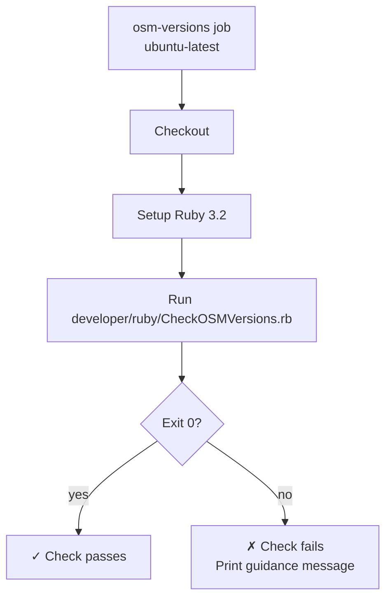

# Workflow: `check_osm_versions.yml` — OSM Version Gate

> **File:** `.github/workflows/check_osm_versions.yml`  
> **Back to:** [CI/CD Overview](../overview.md)

## Purpose

Ensures that all `.osm` files bundled with the application have been version-translated to the current OpenStudio SDK version before a PR is merged to `master`. This prevents shipping stale template models that would trigger the version translation warning at startup.

---

## Trigger

```yaml
on:
  pull_request:
    branches: [master]
```

Runs only on PRs targeting `master` (not `develop`).

---

## Jobs



---

## Key Step

```yaml
- name: Check OSM versions
  run: ruby developer/ruby/CheckOSMVersions.rb
```

`CheckOSMVersions.rb` reads all `.osm` files in `src/openstudio_app/Resources/` and verifies that each file's `OS:Version` object matches the expected SDK version (extracted from `FindOpenStudioSDK.cmake`).

---

## Failure Guidance

On failure, the workflow prints:

> Run the `export_standards_data` workflow (see [workflows/export_standards_data.md](export_standards_data.md)) to regenerate the OSM files, or run `developer/ruby/UpdateOSMVersions.rb` locally and commit the result.

---

## Related Files

| File | Role |
|---|---|
| `developer/ruby/CheckOSMVersions.rb` | The version-checking script |
| `developer/ruby/UpdateOSMVersions.rb` | Locally run script to translate OSM files |
| `src/openstudio_app/Resources/*.osm` | OSM template files that are checked |
| `FindOpenStudioSDK.cmake` | Source of the expected SDK version |
