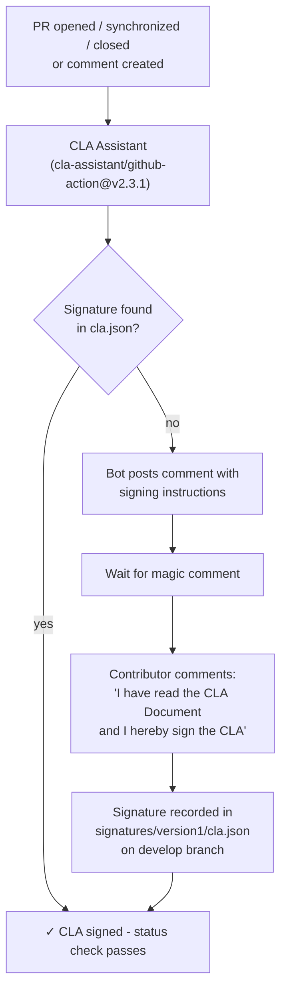

# Workflow: `cla.yml` — CLA Enforcement

> **File:** `.github/workflows/cla.yml`  
> **Back to:** [CI/CD Overview](../overview.md)

## Purpose

Enforces the Contributor License Agreement (CLA) for all external contributors. Any PR author who has not yet signed the CLA will see a blocking status check with instructions on how to sign.

---

## Trigger

```yaml
on:
  issue_comment:
    types: [created]
  pull_request_target:
    types: [opened, closed, synchronize]
```

`pull_request_target` runs in the context of the **base branch** (not the PR branch), which gives the workflow write access needed to post comments and update PR status even from fork PRs.

---

## Job



---

## Configuration

| Setting | Value |
|---|---|
| CLA document | [CLA.md](../../../../CLA.md) |
| Signature storage | `signatures/version1/cla.json` on `develop` branch |
| Sign magic comment | `"I have read the CLA Document and I hereby sign the CLA"` |
| Re-check comment | `"recheck"` |

---

## Required Secrets

| Secret | Purpose |
|---|---|
| `CLA_SECRET` | GitHub personal access token with `repo` scope; allows the action to read/write `cla.json` on the `develop` branch |

---

## Notes

- Organization members are typically excluded from CLA requirements (configured in the action).
- Bots (`[bot]` suffix in username) are automatically excluded.
- Signatures persist across PRs; a contributor only needs to sign once.
