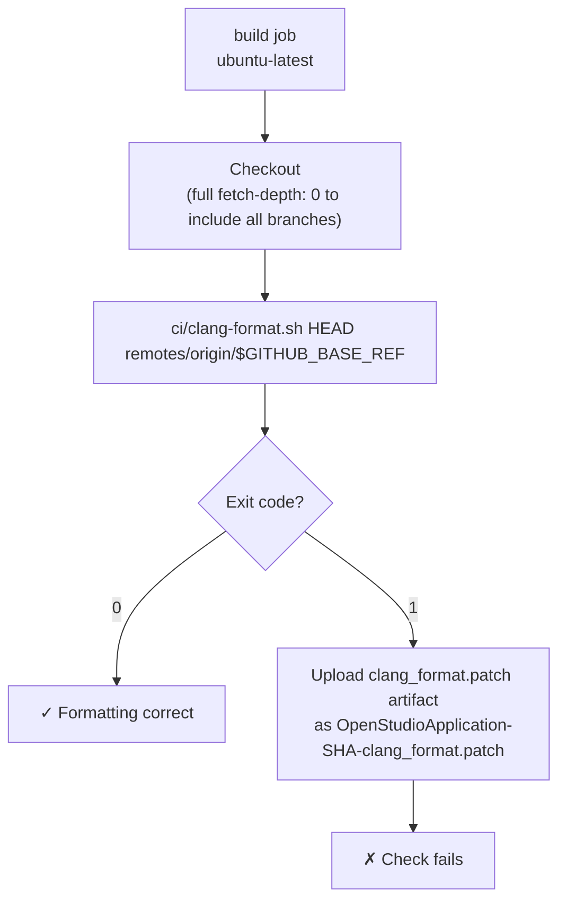

# Workflow: `clangformat.yml` — Code Style Enforcement

> **File:** `.github/workflows/clangformat.yml`  
> **Back to:** [CI/CD Overview](../overview.md)

## Purpose

Enforces that all C/C++ source files changed in a PR are formatted according to the project's `.clang-format` style. PRs with formatting violations produce a downloadable patch and a failing status check.

---

## Trigger

```yaml
on:
  pull_request:
    branches: [master, develop]
```

---

## Job



---

## Key Step

```bash
ci/clang-format.sh HEAD remotes/origin/$GITHUB_BASE_REF
```

This runs clang-format only on the files changed by the PR (diff between `HEAD` and the base branch). See [scripts.md](../scripts.md#ciclang-formatsh) for full script documentation.

---

## Fixing Violations

Download the `clang_format.patch` artifact and apply it:

```bash
git apply clang_format.patch
git commit -am "Apply clang-format"
git push
```

Or run locally before committing:

```bash
ci/clang-format.sh HEAD origin/develop
git diff  # should be empty
```

Install the pre-commit hook to catch violations before pushing:

```bash
cd .git/hooks && ln -s ../../ci/pre-commit.sh pre-commit
```

---

## Related Files

| File | Role |
|---|---|
| `.clang-format` | Style configuration file |
| `ci/clang-format.sh` | Script invoked by this workflow |
| `ci/pre-commit.sh` | Local pre-commit hook equivalent |
