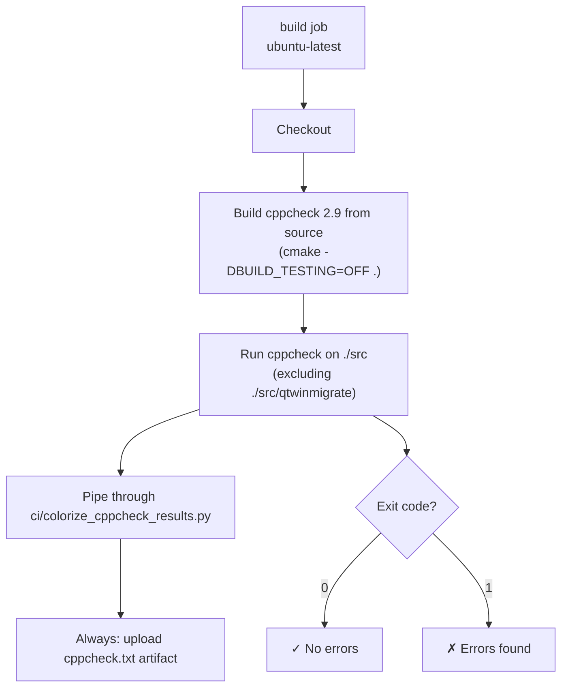

# Workflow: `cppcheck.yml` — Static Analysis

> **File:** `.github/workflows/cppcheck.yml`  
> **Back to:** [CI/CD Overview](../overview.md)

## Purpose

Runs `cppcheck` static analysis on the entire `src/` tree to detect potential bugs, style violations, and undefined behavior. Output is colorized by severity and stored as a build artifact.

---

## Trigger

```yaml
on:
  push:
    branches: [master]
  pull_request:
    branches: [master, develop]
```

---

## Job



---

## Cppcheck Configuration

```bash
cppcheck \
  --std=c++20 \
  --enable=all \
  --library=qt \
  --suppress=useStlAlgorithm \
  --inconclusive \
  --template='[{file}:{line}]:({severity}),[{id}],{message}' \
  -j $(nproc) \
  --output-file=cppcheck.txt \
  -i ./src/qtwinmigrate \
  ./src
```

| Option | Purpose |
|---|---|
| `--std=c++20` | Parse using C++20 standard |
| `--enable=all` | Enable all check categories |
| `--library=qt` | Use Qt-specific definitions to reduce false positives |
| `--suppress=useStlAlgorithm` | Suppress noisy "use `std::find` instead of loop" suggestions |
| `--inconclusive` | Include checks that may have false positives |
| `-i ./src/qtwinmigrate` | Exclude the third-party Qt/Win32 bridge |

---

## Why Build cppcheck from Source?

The Ubuntu system `cppcheck` package is typically several major versions behind. Building version 2.9 from source ensures consistent results across CI runs and access to newer checks.

---

## Artifacts

| Artifact | Contents |
|---|---|
| `cppcheck.txt` | Full cppcheck output (always uploaded, regardless of pass/fail) |

---

## Related Files

| File | Role |
|---|---|
| `ci/colorize_cppcheck_results.py` | Post-processes cppcheck output with ANSI colors |
