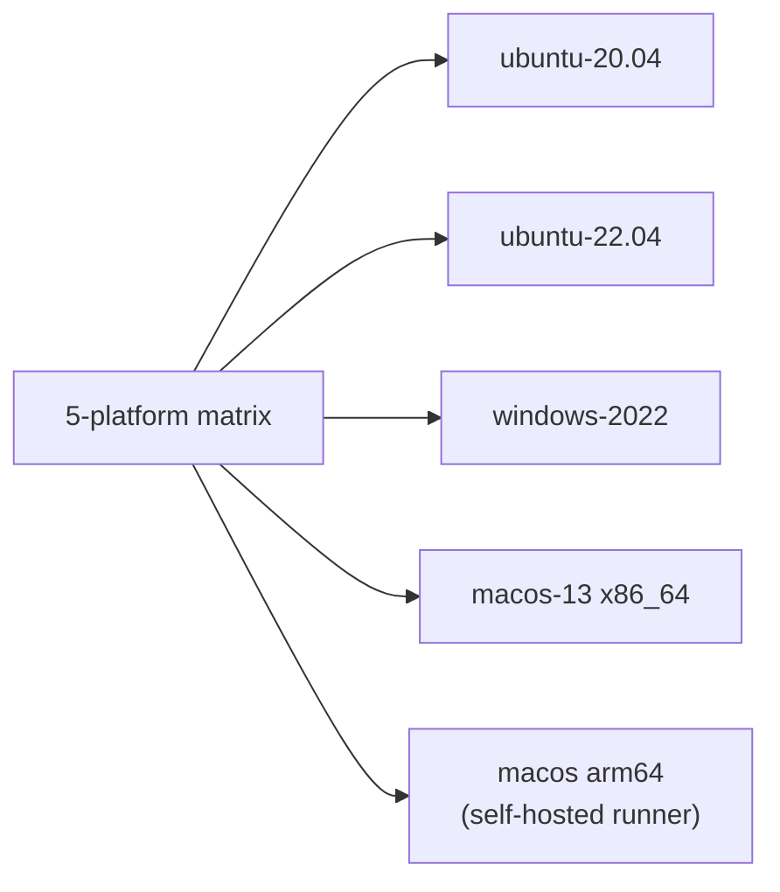
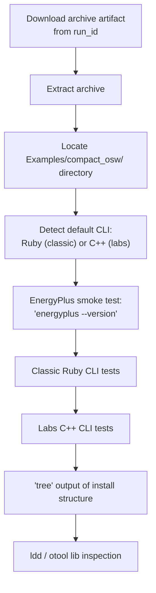

# Workflow: `manual_cli_test.yml` — Manual CLI Integration Test

> **File:** `.github/workflows/manual_cli_test.yml`  
> **Back to:** [CI/CD Overview](../overview.md)

## Purpose

Manually triggered smoke test workflow that downloads a previously built installer archive from a specific workflow run and verifies that the OpenStudio CLI works correctly on all 5 platforms. Tests cover both the classic Ruby CLI and the newer C++ (labs) CLI, including EnergyPlus and Python scripting.

---

## Trigger

```yaml
on:
  workflow_dispatch:
    inputs:
      run_id:
        description: 'Run ID of the app_build workflow to test'
        required: true
```

---

## Matrix



---

## Job Steps



---

## Test Coverage

### Classic Ruby CLI Tests

| Test | Command |
|---|---|
| Help | `openstudio --help` |
| Version | `openstudio --version` |
| Ruby snippet | `openstudio -e "puts OpenStudio::openStudioVersion()"` |
| Gem require | `openstudio -e "require 'oga'; puts 'oga OK'"` |
| Execute script | `openstudio execute_ruby_script test.rb` |
| Run workflow | `openstudio run -w compact_ruby_only.osw` |

### Labs C++ CLI Tests

All Ruby tests above, plus:

| Test | Command |
|---|---|
| Python version | `openstudio labs python --version` |
| Execute Python script | `openstudio labs execute_python_script test.py` |
| Mixed Ruby/Python OSW | `openstudio run -w compact_ruby_python.osw` |
| Multiple mixed workflows | Additional OSW permutations |

---

## When to Run

- After a successful `app_build.yml` run produces installer artifacts that you want to validate before releasing
- When investigating CLI regressions on a specific platform
- After updating Ruby or Python bindings

---

## Required Inputs

| Input | Description |
|---|---|
| `run_id` | The numeric ID of a prior `app_build.yml` workflow run (visible in the GitHub Actions URL) |
