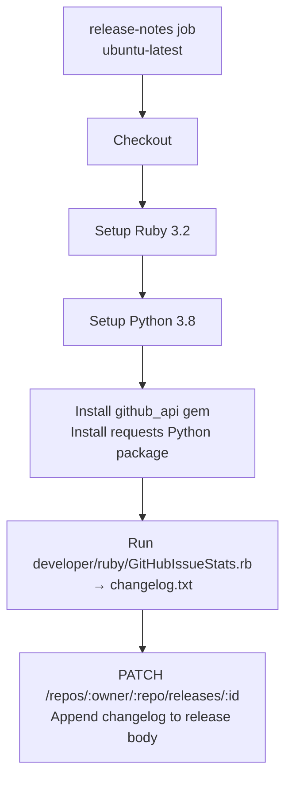

# Workflow: `release_notes.yml` — Automated Changelog

> **File:** `.github/workflows/release_notes.yml`  
> **Back to:** [CI/CD Overview](../overview.md)

## Purpose

Automatically generates and appends a changelog to a GitHub Release when the release is created. The changelog is built by querying the GitHub Issues API for all issues closed since the last release.

---

## Trigger

```yaml
on:
  release:
    types: [created]
```

Fires once when a new GitHub Release is created (not on draft creation).

---

## Job



---

## Key Step

`developer/ruby/GitHubIssueStats.rb` queries the GitHub Issues API for issues closed between the previous release tag and the current one, formats them into a Markdown changelog, and writes `changelog.txt`.

The changelog is then appended to the release body via:
```bash
curl -X PATCH \
  -H "Authorization: token $GITHUB_TOKEN" \
  -H "Content-Type: application/json" \
  -d "{\"body\": \"$RELEASE_BODY\n\n$CHANGELOG\"}" \
  https://api.github.com/repos/openstudiocoalition/OpenStudioApplication/releases/$RELEASE_ID
```

---

## Outputs

The GitHub Release body is updated to include a section like:

```markdown
## Changes

### Bug Fixes
- Fix crash when opening models with orphan spaces (#1234)

### New Features
- Add support for EnergyPlus 24.1 output variables (#1198)

### Improvements
- Improve geometry editor performance on large models (#1201)
```

---

## Related Files

| File | Role |
|---|---|
| `developer/ruby/GitHubIssueStats.rb` | Generates the changelog from GitHub Issues API |
