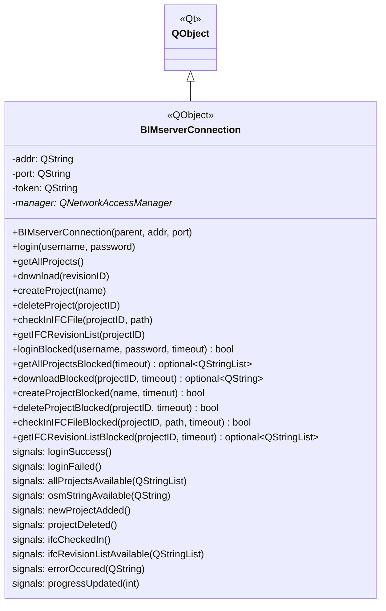

# Class: `BIMserverConnection`

> **Module:** `bimserver`  
> **Header:** [src/bimserver/BIMserverConnection.hpp](../../../../src/bimserver/BIMserverConnection.hpp)  
> **Library doc:** [libraries/bimserver.md](../../libraries/bimserver.md)

## Purpose

`BIMserverConnection` is the HTTP client for the BIMserver REST API. It uses Qt's `QNetworkAccessManager` to send JSON-RPC style POST requests to a BIMserver instance and routes responses back to callers via Qt signals (async) or blocking return values (sync).

A single `BIMserverConnection` is associated with one BIMserver address/port pair. All authentication state (session token) is maintained internally after a successful login.

---

## Class Diagram

---

## Constructor

| Parameter | Type | Description |
|---|---|---|
| `parent` | `QObject*` | Qt parent (typically `ProjectImporter`) |
| `bimserverAddr` | `const QString&` | Hostname or IP of the BIMserver instance |
| `bimserverPort` | `const QString&` | Port number (e.g., `"8080"`) |

---

## Non-Blocking API

All non-blocking methods POST a JSON request and return immediately. The result is delivered asynchronously via the corresponding signal.

| Method | Response signal |
|---|---|
| `login(username, password)` | `loginSuccess()` / `loginFailed()` |
| `getAllProjects()` | `allProjectsAvailable(QStringList)` |
| `download(revisionID)` | `osmStringAvailable(QString)` |
| `createProject(name)` | `newProjectAdded()` |
| `deleteProject(projectID)` | `projectDeleted()` |
| `checkInIFCFile(projectID, path)` | `ifcCheckedIn()` + `progressUpdated(int)` |
| `getIFCRevisionList(projectID)` | `ifcRevisionListAvailable(QStringList)` |

---

## Blocking API

Each blocking variant spins a `QEventLoop` with a `QTimer` timeout. Returns a result or `boost::none` on timeout/failure.

| Method | Returns |
|---|---|
| `loginBlocked(username, password, timeout)` | `bool` |
| `getAllProjectsBlocked(timeout)` | `optional<QStringList>` |
| `downloadBlocked(projectID, timeout)` | `optional<QString>` (OSM string) |
| `createProjectBlocked(name, timeout)` | `bool` |
| `deleteProjectBlocked(projectID, timeout)` | `bool` |
| `checkInIFCFileBlocked(projectID, path, timeout)` | `bool` |
| `getIFCRevisionListBlocked(projectID, timeout)` | `optional<QStringList>` |

---

## Qt Signals

| Signal | Arguments | Description |
|---|---|---|
| `loginSuccess` | — | Login POST succeeded and a session token was received |
| `loginFailed` | — | Login failed (wrong credentials or server unreachable) |
| `allProjectsAvailable` | `QStringList projects` | List of project names returned by the server |
| `osmStringAvailable` | `QString osmString` | Full OSM file content returned after download |
| `errorOccured` | `QString message` | Any network or protocol error |
| `progressUpdated` | `int percent` | IFC check-in progress (0–100) |
