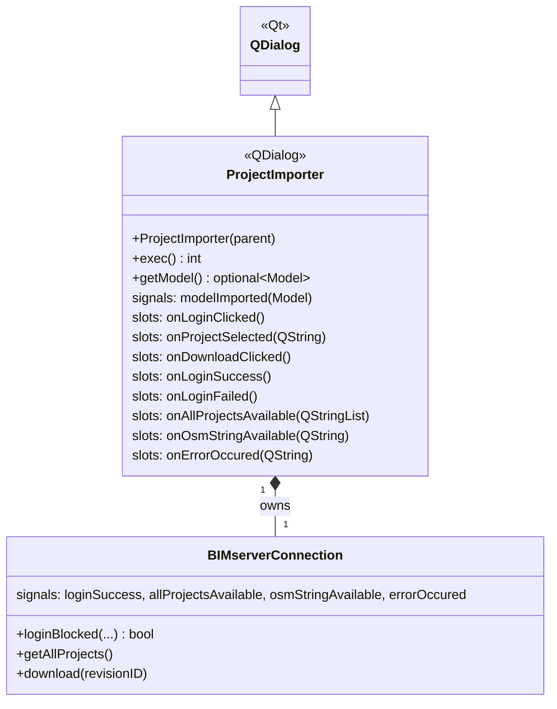
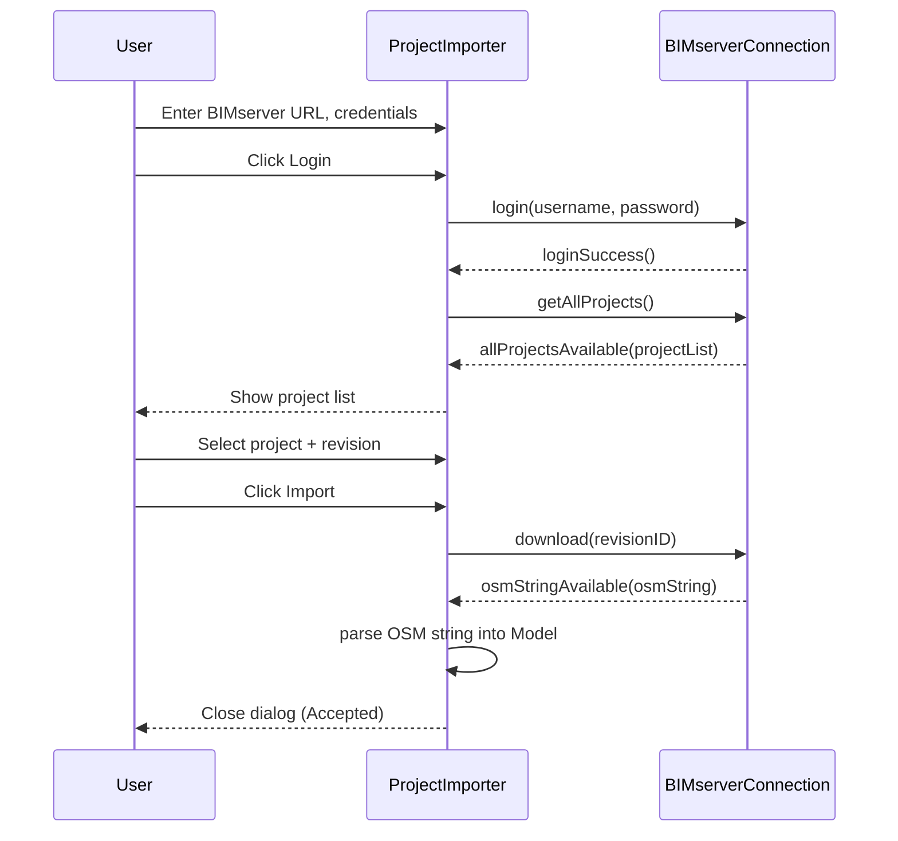

# Class: `ProjectImporter`

> **Module:** `bimserver`  
> **Header:** [src/bimserver/ProjectImporter.hpp](../../../../src/bimserver/ProjectImporter.hpp)  
> **Library doc:** [libraries/bimserver.md](../../libraries/bimserver.md)

## Purpose

`ProjectImporter` is a dialog-based workflow that guides the user through connecting to a BIMserver, listing available projects, selecting one, and importing it as an OpenStudio Model.

It owns a `BIMserverConnection` and orchestrates the multi-step process:
1. Show the BIMserver address/port/credentials form
2. Log in and retrieve the project list
3. Let the user select a project and revision
4. Download the OSM content and parse it into an `openstudio::model::Model`

---

## Class Diagram

---

## Constructor

| Parameter | Type | Description |
|---|---|---|
| `parent` | `QWidget*` | Qt parent widget |

---

## Key Public Methods

| Method | Returns | Description |
|---|---|---|
| `exec()` | `int` | Shows the dialog modally; returns `QDialog::Accepted` if the user successfully imported a project |
| `getModel()` | `boost::optional<model::Model>` | Returns the imported model after `exec()` returns `Accepted` |

---

## Qt Signals

| Signal | Arguments | Description |
|---|---|---|
| `modelImported` | `model::Model` | Emitted when the import is complete; callers can connect to this to receive the model without waiting for `exec()` |

---

## Import Workflow

