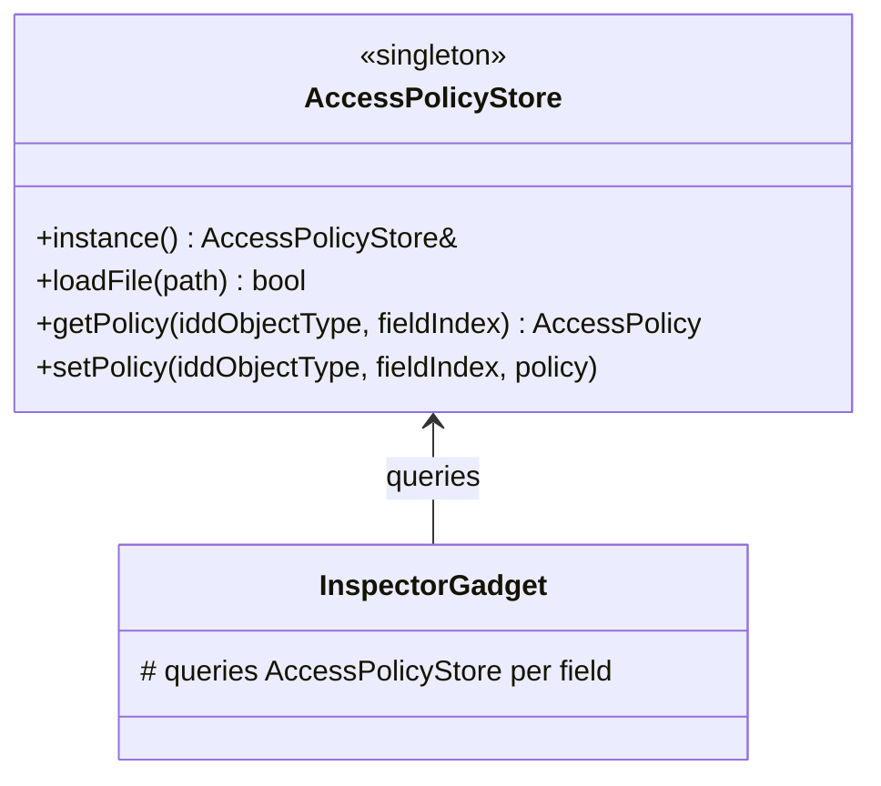

# Class: `AccessPolicyStore`

> **Module:** `model_editor`  
> **Header:** [src/model_editor/AccessPolicyStore.hpp](../../../../src/model_editor/AccessPolicyStore.hpp)  
> **Library doc:** [libraries/model_editor.md](../../libraries/model_editor.md)

## Purpose

`AccessPolicyStore` is a singleton that controls which IDD fields `InspectorGadget` renders as editable, read-only, or hidden. It reads an XML policy file at startup and provides per-field `AccessPolicy` queries to `InspectorGadget` during widget construction.

Without a loaded policy, all fields default to `FREE` (editable).

---

## Class Diagram



---

## `AccessPolicy` Enum

| Value | Meaning |
|---|---|
| `FREE` | Field is editable; rendered as an input widget (spinbox, combobox, lineedit) |
| `LOCKED` | Field is read-only; rendered as a `QLabel` |
| `HIDDEN` | Field is not rendered at all |

---

## Key Public Methods

| Method | Returns | Description |
|---|---|---|
| `instance()` | `AccessPolicyStore&` | Returns the singleton instance |
| `loadFile(path)` | `bool` | Parses an XML policy file; returns `false` if the file cannot be opened or parsed |
| `getPolicy(iddObjectType, fieldIndex)` | `AccessPolicy` | Returns the policy for a specific IDD object type and field index |
| `setPolicy(iddObjectType, fieldIndex, policy)` | `void` | Programmatically overrides a policy at runtime |

---

## Policy File Format

The XML policy file specifies overrides from the `FREE` default:

```xml
<AccessPolicies>
  <IddObject name="OS:ThermalZone">
    <field index="0" policy="LOCKED"/>   <!-- Name: locked, user shouldn't change -->
    <field index="5" policy="HIDDEN"/>   <!-- Internal bookkeeping field -->
  </IddObject>
</AccessPolicies>
```

Fields not listed default to `FREE`. To lock all fields for an object type, specify policy `LOCKED` with `index="*"`.
