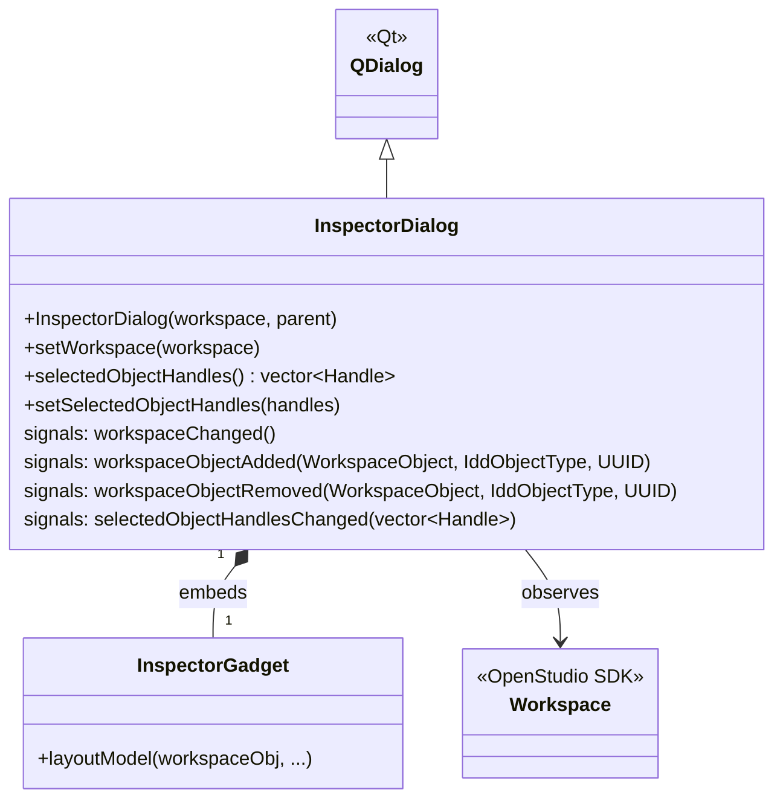

# Class: `InspectorDialog`

> **Module:** `model_editor`  
> **Header:** [src/model_editor/InspectorDialog.hpp](../../../../src/model_editor/InspectorDialog.hpp)  
> **Library doc:** [libraries/model_editor.md](../../libraries/model_editor.md)

## Purpose

`InspectorDialog` is a modal or modeless top-level dialog that hosts an `InspectorGadget`. It subscribes to a `Workspace` (or `Model`) to track object additions/removals and update the gadget whenever the selected object changes.

It is primarily used as a standalone debugging tool and in the SketchUp plugin to inspect arbitrary model objects.

---

## Class Diagram

---

## Constructor

| Parameter | Type | Description |
|---|---|---|
| `workspace` | `openstudio::Workspace&` | The workspace to observe; the dialog subscribes to its object change signals |
| `parent` | `QWidget*` | Qt parent (can be nullptr for modeless usage) |

---

## Key Public Methods

| Method | Returns | Description |
|---|---|---|
| `setWorkspace(workspace)` | `void` | Detaches from old workspace, subscribes to new; clears and re-populates the gadget |
| `selectedObjectHandles()` | `vector<Handle>` | Returns the handles of objects currently selected in the object type list |
| `setSelectedObjectHandles(handles)` | `void` | Programmatically selects objects to inspect |

---

## Qt Signals

| Signal | Arguments | Description |
|---|---|---|
| `workspaceChanged` | — | Emitted when the workspace is replaced |
| `workspaceObjectAdded` | `WorkspaceObject, IddObjectType, UUID` | Forwarded from the workspace |
| `workspaceObjectRemoved` | `WorkspaceObject, IddObjectType, UUID` | Forwarded from the workspace |
| `selectedObjectHandlesChanged` | `vector<Handle>` | Emitted when selection changes |
