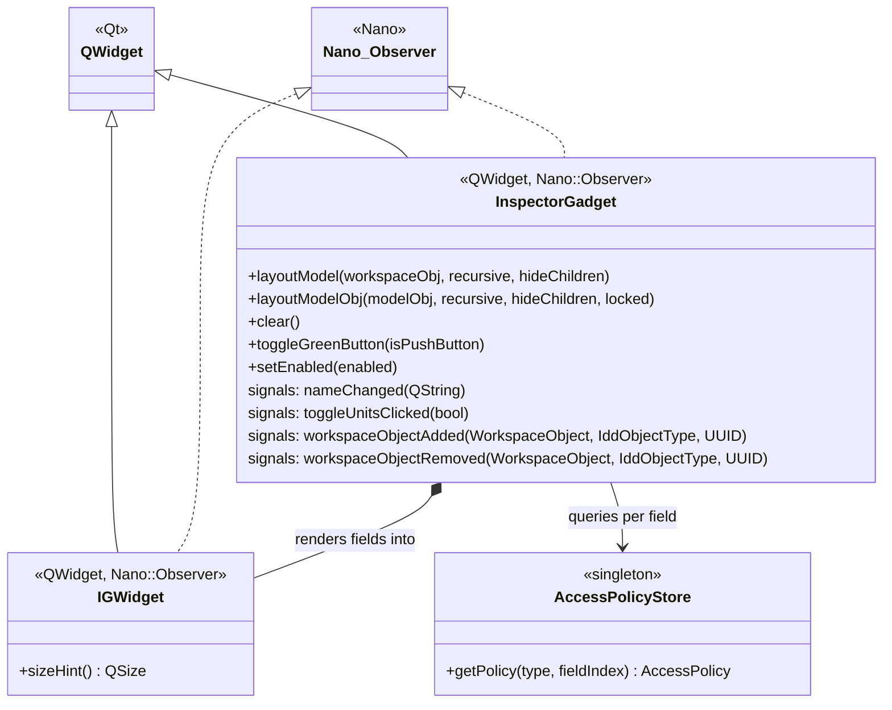

# Class: `InspectorGadget`

> **Module:** `model_editor`  
> **Header:** [src/model_editor/InspectorGadget.hpp](../../../../src/model_editor/InspectorGadget.hpp)  
> **Library doc:** [libraries/model_editor.md](../../libraries/model_editor.md)

## Purpose

`InspectorGadget` is the core widget of the `model_editor` module. It accepts any `WorkspaceObject` or `ModelObject` and automatically generates a widget layout for all its IDD-defined fields, using `AccessPolicyStore` to determine which fields are editable, read-only, or hidden.

This provides a "free" generic inspector for any OpenStudio object type without writing bespoke UI code.

---

## Class Diagram

---

## Key Public Methods

| Method | Returns | Description |
|---|---|---|
| `layoutModel(wObj, recursive, hideChildren)` | `void` | Populates the widget from a `WorkspaceObject`; recursively follows references if `recursive = true` |
| `layoutModelObj(mObj, recursive, hideChildren, locked)` | `void` | Same, but starts from a `ModelObject`; `locked = true` forces all fields into read-only mode |
| `clear()` | `void` | Removes all generated widgets |
| `toggleGreenButton(isPushButton)` | `void` | Switches the "inspect object" button style |
| `setEnabled(bool)` | `void` | Enables/disables all child widgets |

---

## Qt Signals

| Signal | Arguments | Description |
|---|---|---|
| `nameChanged` | `QString newName` | Emitted when the user edits the object's Name field |
| `toggleUnitsClicked` | `bool displayIP` | Emitted when the IP/SI toggle button is clicked |
| `workspaceObjectAdded` | `WorkspaceObject, IddObjectType, UUID` | Forwarded from the workspace; keeps the inspector in sync |
| `workspaceObjectRemoved` | `WorkspaceObject, IddObjectType, UUID` | Forwarded from the workspace |

---

## Field Generation Rules

| IDD Field Type | `FREE` policy | `LOCKED` policy |
|---|---|---|
| Real | `QDoubleSpinBox` | `QLabel` |
| Integer | `QSpinBox` | `QLabel` |
| Alpha / String | `QLineEdit` | `QLabel` |
| Choice | `IGComboBox` | `QLabel` |
| Boolean | `QCheckBox` | `QLabel` |
| Object reference | `QLineEdit` + lookup button | `QLabel` (hyperlink) |

Fields with `AccessPolicy::HIDDEN` are not rendered at all.

---

## `IGWidget`

`IGWidget` is a thin `QWidget`/`Nano::Observer` subclass that serves as the scroll area content host for the generated controls. It overrides `sizeHint()` to correctly report its natural size after field generation.
