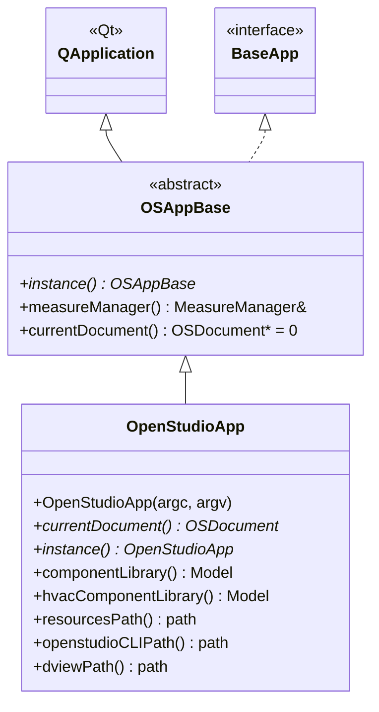

# Class: `OpenStudioApp`

> **Module:** `openstudio_app`  
> **Header:** [src/openstudio_app/OpenStudioApp.hpp](../../../../src/openstudio_app/OpenStudioApp.hpp)  
> **Library doc:** [libraries/openstudio_app.md](../../libraries/openstudio_app.md)

## Purpose

`OpenStudioApp` is the concrete application object for the standalone OpenStudio Application. It extends `OSAppBase` (which extends `QApplication`) and is instantiated once in `main()`.

Responsibilities:
- Constructs the initial `StartupView` and `StartupMenu` at launch
- Opens new or existing `.osm` files and wraps them in an `OSDocument`
- Runs `osversion::VersionTranslator` asynchronously (via `QFutureWatcher`) when opening older model files
- Provides access to the component library and HVAC template library models
- Manages translation (i18n) via `QTranslator`
- Handles the `dview` external tool path preference

---

## Class Diagram



---

## Constructor

| Parameter | Type | Description |
|---|---|---|
| `argc` | `int&` | Standard C++ `argc` (passed through to `QApplication`) |
| `argv` | `char**` | Standard C++ `argv` (passed through to `QApplication`) |

The constructor initialises the Qt application, registers `QMetaTypes`, installs the application icon, loads the QSS stylesheet (`resources/openstudio.qss`), instantiates `MeasureManager`, and shows the `StartupView`.

---

## Key Public Methods

| Method | Returns | Description |
|---|---|---|
| `currentDocument()` | `shared_ptr<OSDocument>` | Returns the currently open document, or `nullptr` if no document is open |
| `instance()` | `OpenStudioApp*` | Static method; returns the singleton application instance cast to `OpenStudioApp*` |
| `componentLibrary()` | `model::Model` | Returns the loaded component library model (for drag-and-drop from the right column library tab) |
| `hvacComponentLibrary()` | `model::Model` | Returns the HVAC template library containing pre-built loop templates |
| `resourcesPath()` | `openstudio::path` | Absolute path to the application's resources directory, resolved relative to the running executable |
| `openstudioCLIPath()` | `openstudio::path` | Absolute path to the `openstudio` CLI executable bundled with the application |
| `dviewPath()` | `openstudio::path` | Path to the DView results viewer, from settings or inferred from `PATH` |

---

## Qt Signals

| Signal | Arguments | Description |
|---|---|---|
| `requestCloseAll` | — | Emitted when the application is about to quit; triggers document close |
| `newModelDropped` | — | Emitted when the user drops a new model file onto the application window |

---

## Key Data Members

| Member | Type | Description |
|---|---|---|
| `m_startupView` | `StartupView*` | Splash/welcome screen shown before a document is open |
| `m_startupMenu` | `StartupMenu*` | Minimal menu bar for the startup screen |
| `m_document` | `shared_ptr<OSDocument>` | The currently open document |
| `m_versionTranslator` | `QFutureWatcher<...>` | Async watcher for version translation tasks |
| `m_translators` | `QList<QTranslator*>` | Loaded i18n translators |

---

## Usage Pattern

```cpp
// main.cpp
int main(int argc, char *argv[]) {
    OpenStudioApp app(argc, argv);
    return app.exec();
}
```

All subsequent access to the application object is via the static accessor:
```cpp
OpenStudioApp* app = OpenStudioApp::instance();
auto model = app->currentDocument()->model();
```
