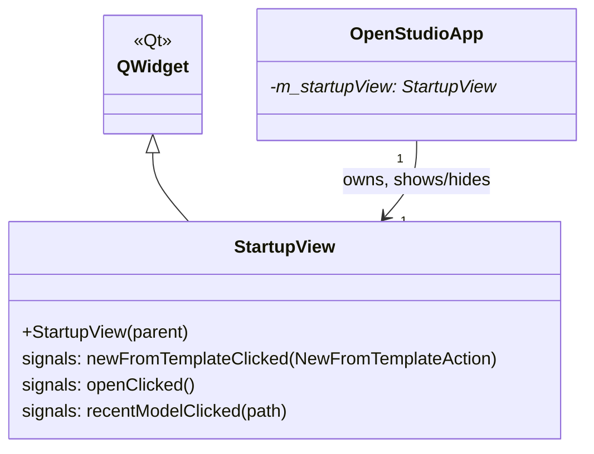

# Class: `StartupView`

> **Module:** `openstudio_app`  
> **Header:** [src/openstudio_app/StartupView.hpp](../../../../src/openstudio_app/StartupView.hpp)  
> **Library doc:** [libraries/openstudio_app.md](../../libraries/openstudio_app.md)

## Purpose

`StartupView` is the welcome/splash screen displayed when the OpenStudio Application launches and no document is yet open. It presents the user with options to create a new model, open an existing file, or select a recently used file.

It is shown and hidden by `OpenStudioApp` in response to document open/close events. When the user opens a document, `StartupView` is hidden; when they close the last document, it reappears.

---

## Class Diagram

---

## Qt Signals

| Signal | Arguments | Description |
|---|---|---|
| `newFromTemplateClicked` | `NewFromTemplateAction` | User clicked one of the "New from template" buttons; the action enum identifies which template |
| `openClicked` | — | User clicked "Open..." — triggers a file dialog in `OpenStudioApp` |
| `recentModelClicked` | `openstudio::path` | User selected a recently used model from the list |

---

## Key Data Members

The view contains:
- A logo/banner area with the OpenStudio Coalition branding
- A list of "New from template" buttons for common starting points (empty model, residential, commercial)
- An "Open..." button
- A scrollable recent files list showing the last N opened `.osm` files with their paths

---

## Relationship to `StartupMenu`

`StartupMenu` provides a minimal menu bar (File → New, Open, Quit) that is installed on the application's main window while `StartupView` is visible. When a document is loaded, the full `MainMenu` replaces it.
