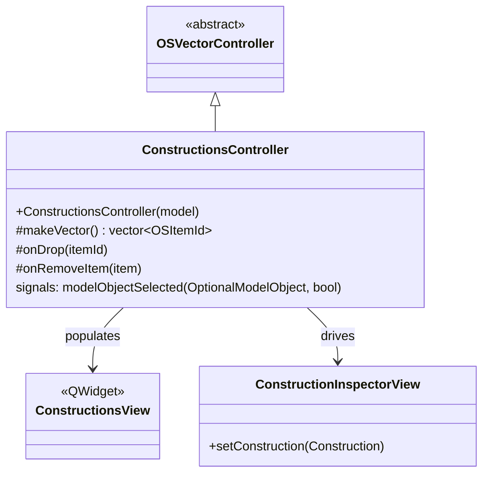

# Class: `ConstructionsController`

> **Module:** `openstudio_lib`  
> **Header:** [src/openstudio_lib/ConstructionsController.hpp](../../../../src/openstudio_lib/ConstructionsController.hpp)  
> **Library doc:** [libraries/openstudio_lib.md](../../libraries/openstudio_lib.md)

## Purpose

`ConstructionsController` manages the Constructions sub-tab within the Constructions & Materials domain tab. It provides a list of all construction objects in the model, allows adding new constructions (by dropping from the component library or creating new ones), and drives the right-column inspector to show construction details when one is selected.

It extends `OSVectorController` to supply the list of construction `OSItemId`s.

---

## Class Diagram

---

## `makeVector()` Override

Returns `OSItemId`s for all `openstudio::model::Construction`, `ConstructionWithInternalSource`, `ConstructionCfactorUndergroundWall`, `ConstructionFfactorGroundFloor`, and `ConstructionAirBoundary` objects in the model.

## `onDrop()` Override

Handles drops from the component library: if the dropped `OSItemId` references a BCL component or a component library construction, loads it into the model.

## `onRemoveItem()` Override

Removes the selected construction from the model after confirming there are no dependent surfaces still referencing it.

---

## Qt Signals

| Signal | Arguments | Description |
|---|---|---|
| `modelObjectSelected` | `OptionalModelObject, bool readOnly` | Emitted on selection; drives the inspector |
