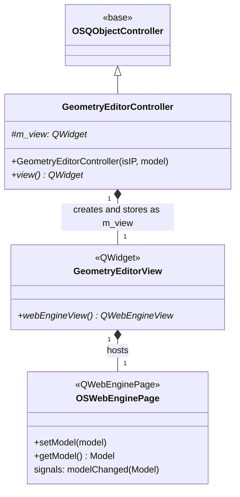
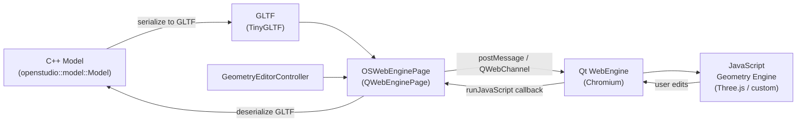

# Class: `GeometryEditorController`

> **Module:** `openstudio_lib`  
> **Header:** [src/openstudio_lib/GeometryEditorController.hpp](../../../../src/openstudio_lib/GeometryEditorController.hpp)  
> **Library doc:** [libraries/openstudio_lib.md](../../libraries/openstudio_lib.md)

## Purpose

`GeometryEditorController` manages the Geometry tab's interactive 3D editor. The editor is implemented as a Qt WebEngine view hosting a JavaScript application that renders and edits OpenStudio geometry. The controller bridges the C++ model layer and the JavaScript geometry engine via `OSWebEnginePage`.

---

## Class Diagram

---

## Constructor

| Parameter | Type | Description |
|---|---|---|
| `isIP` | `bool` | Whether to display dimensions in imperial units |
| `model` | `const model::Model&` | The OpenStudio model whose geometry is displayed |

---

## Key Public Methods

| Method | Returns | Description |
|---|---|---|
| `view()` | `QWidget*` | The view widget (`GeometryEditorView`) to embed in the tab |

---

## Architecture Note

The geometry editor is built around a JS/C++ bridge:

Model geometry is serialised to GLTF JSON and injected into the JavaScript engine; user edits in 3D are sent back as GLTF diffs, which `OSWebEnginePage` deserialises back into OpenStudio model objects.

See [OSWebEnginePage](OSWebEnginePage.md) for the JS bridge API details.
