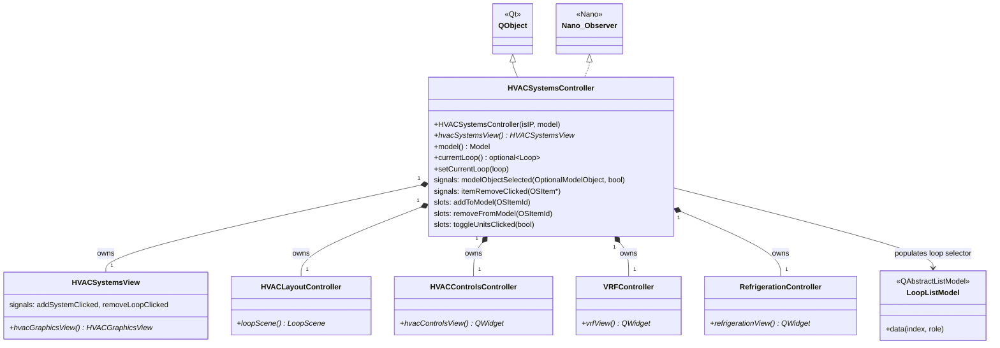

# Class: `HVACSystemsController`

> **Module:** `openstudio_lib`  
> **Header:** [src/openstudio_lib/HVACSystemsController.hpp](../../../../src/openstudio_lib/HVACSystemsController.hpp)  
> **Library doc:** [libraries/openstudio_lib.md](../../libraries/openstudio_lib.md)

## Purpose

`HVACSystemsController` manages the HVAC Systems tab, which is the most complex tab in the application. It displays a graphical scene of HVAC loops (air loops, plant loops, service water loops, VRF systems, refrigeration systems) and allows users to add, remove, and configure HVAC components by dragging them on the scene.

The controller owns sub-controllers for different aspects of HVAC display:
- `HVACLayoutController` — manages the loop topology `QGraphicsScene` (component placement)
- `HVACControlsController` — manages the controls view (setpoint managers, availability managers, mechanical ventilation)
- `RefrigerationController` / `RefrigerationGridController` — dedicated refrigeration system view
- `VRFController` — dedicated VRF system view

---

## Class Diagram

---

## Constructor

| Parameter | Type | Description |
|---|---|---|
| `isIP` | `bool` | Whether to display values in imperial units |
| `model` | `const model::Model&` | The OpenStudio model containing HVAC objects |

---

## `SceneType` Enum

| Value | Description |
|---|---|
| `TOPOLOGY` | Shows the graphical loop diagram (default) |
| `CONTROLS` | Shows the setpoint managers and controls configuration |

---

## Key Public Methods

| Method | Returns | Description |
|---|---|---|
| `hvacSystemsView()` | `HVACSystemsView*` | The main view widget for the HVAC tab |
| `model()` | `model::Model` | The current model |
| `currentLoop()` | `optional<model::Loop>` | The currently selected loop (air, plant, or VRF) |
| `setCurrentLoop(loop)` | `void` | Switches the scene to display the given loop |

---

## Qt Signals

| Signal | Arguments | Description |
|---|---|---|
| `modelObjectSelected` | `OptionalModelObject, bool readOnly` | Emitted when user clicks an HVAC component; drives the right-column inspector |
| `itemRemoveClicked` | `OSItem*` | Emitted when user removes a component |

---

## Qt Slots

| Slot | Arguments | Description |
|---|---|---|
| `addToModel` | `OSItemId` | Adds the identified HVAC component type to the current loop |
| `removeFromModel` | `OSItemId` | Removes the identified component from the current loop |
| `toggleUnitsClicked` | `bool displayIP` | Refreshes all numeric displays on units change |

---

## HVAC Scenes

The topology scene is built from `LoopScene` (for air/plant loops), `ServiceWaterScene` (for service hot water loops), and custom scenes for VRF and refrigeration. Each scene is a `QGraphicsScene` subclass containing `GridItem` and `SystemCenterItem` nodes connected by `TwoConnectorItem` edges, mirroring the loop topology in the model.
