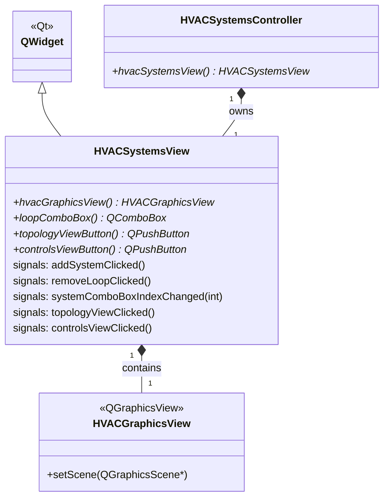

# Class: `HVACSystemsView`

> **Module:** `openstudio_lib`  
> **Header:** [src/openstudio_lib/HVACSystemsView.hpp](../../../../src/openstudio_lib/HVACSystemsView.hpp)  
> **Library doc:** [libraries/openstudio_lib.md](../../libraries/openstudio_lib.md)

## Purpose

`HVACSystemsView` is the top-level view widget for the HVAC Systems tab. It contains:
- A **loop selector** combo box listing all HVAC loops in the model
- A **scene type toggle** (Topology / Controls)
- A `HVACGraphicsView` (`QGraphicsView`) displaying either the loop diagram or the controls panel
- Toolbar buttons for adding/removing loops and HVAC systems

It delegates all display and interaction logic to `HVACSystemsController`, which calls into `HVACLayoutController` and `HVACControlsController`.

---

## Class Diagram

---

## Qt Signals

| Signal | Arguments | Description |
|---|---|---|
| `addSystemClicked` | — | User clicked the "Add System" button to add a new HVAC template |
| `removeLoopClicked` | — | User clicked the "Remove Loop" button |
| `systemComboBoxIndexChanged` | `int index` | User selected a different loop from the drop-down |
| `topologyViewClicked` | — | User switched to the loop topology diagram |
| `controlsViewClicked` | — | User switched to the loop controls view |
