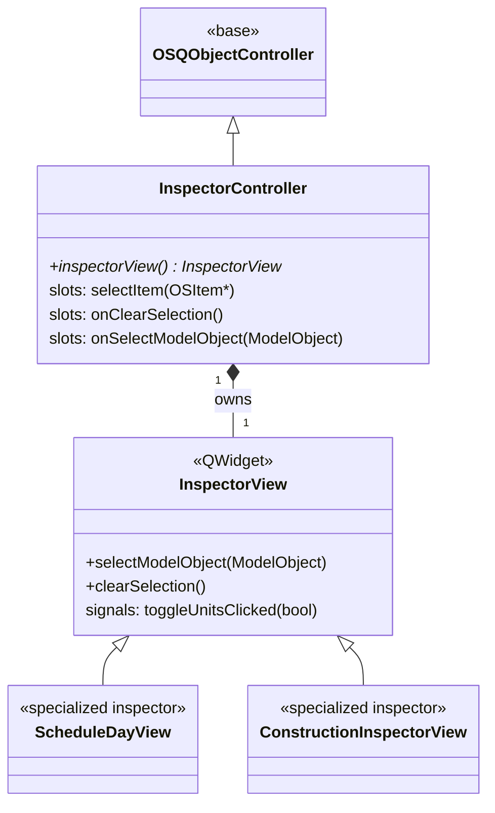

# Class: `InspectorController`

> **Module:** `openstudio_lib`  
> **Header:** [src/openstudio_lib/InspectorController.hpp](../../../../src/openstudio_lib/InspectorController.hpp)  
> **Library doc:** [libraries/openstudio_lib.md](../../libraries/openstudio_lib.md)

## Purpose

`InspectorController` manages the "Edit" tab of the right-column sidebar (`MainRightColumnController`). It receives `modelObjectSelected` signals from the active tab controller, determines the appropriate inspector view for the selected object type, and displays it.

Each domain has its own set of `*InspectorView` classes. `InspectorController` acts as the dispatcher that selects and shows the correct view.

---

## Class Diagram

---

## Qt Slots

| Slot | Arguments | Description |
|---|---|---|
| `selectItem(item)` | `OSItem*` | Called when an item is selected in any list or drop zone; looks up the model object and dispatches to `onSelectModelObject` |
| `onClearSelection()` | — | Clears the inspector (shows a blank/default pane) |
| `onSelectModelObject(obj)` | `model::ModelObject` | Determines the appropriate inspector view for `obj`'s IDD type and switches to it |

---

## Inspector View Selection

`InspectorController` maintains a `QStackedWidget` containing one inspector view per supported object type. On `onSelectModelObject()`, it:
1. Casts the `ModelObject` to the appropriate subtype
2. Calls `QStackedWidget::setCurrentWidget()` with the matching view
3. Calls `view->update(obj)` (or equivalent) to populate the fields

Object types without a dedicated inspector view fall back to a generic `InspectorGadget`-based view from `model_editor`.
