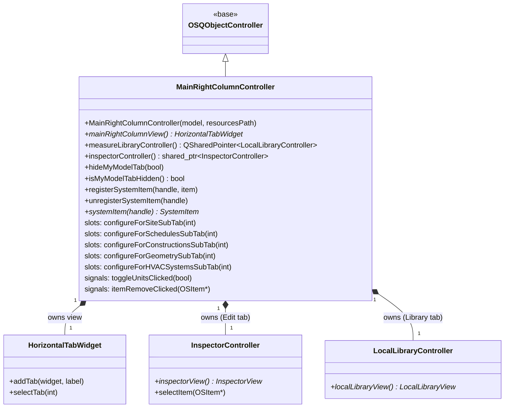

# Class: `MainRightColumnController`

> **Module:** `openstudio_lib`  
> **Header:** [src/openstudio_lib/MainRightColumnController.hpp](../../../../src/openstudio_lib/MainRightColumnController.hpp)  
> **Library doc:** [libraries/openstudio_lib.md](../../libraries/openstudio_lib.md)

## Purpose

`MainRightColumnController` manages the right-column sidebar that appears alongside every tab. The sidebar has three tabs:

| Tab | ID | Contents |
|---|---|---|
| **My Model** | `MY_MODEL` | A list of model objects relevant to the currently active domain tab (e.g., schedule types while on the Schedules tab) |
| **Library** | `LIBRARY` | The local measure/component library browser (`LocalLibraryController`) |
| **Edit** | `EDIT` | An inspector/editor for the currently selected model object |

`OSDocument` calls the `configureFor*SubTab()` slots whenever the active domain tab or sub-tab changes, which switches the right column's content to match the current context.

---

## Class Diagram

---

## Constructor

| Parameter | Type | Description |
|---|---|---|
| `model` | `model::Model` | The document's model; passed to the inspector controller |
| `resourcesPath` | `openstudio::path` | Path used to resolve icon and library resources |

---

## Key Public Methods

| Method | Returns | Description |
|---|---|---|
| `mainRightColumnView()` | `HorizontalTabWidget*` | The widget to embed in the main window's sidebar area |
| `measureLibraryController()` | `QSharedPointer<LocalLibraryController>` | The Library tab's measure browser controller |
| `inspectorController()` | `shared_ptr<InspectorController>` | The Edit tab's inspector controller |
| `hideMyModelTab(bool)` | `void` | Hides the My Model tab when the active domain does not use it (e.g., Run tab) |
| `registerSystemItem(handle, item)` | `void` | Registers a `SystemItem` (HVAC loop) by handle for colour-coordination with the HVAC view |
| `systemItem(handle)` | `SystemItem*` | Returns the registered `SystemItem` for a given handle |

---

## Qt Slots (configureFor* methods)

Each of these is called by `OSDocument` when the user navigates to the corresponding domain:

| Slot | Purpose |
|---|---|
| `configureForSiteSubTab(int)` | Sets up the My Model tab for the Site/Geometry domain |
| `configureForSchedulesSubTab(int)` | Shows relevant schedule types in My Model |
| `configureForConstructionsSubTab(int)` | Shows constructions/materials in My Model |
| `configureForGeometrySubTab(int)` | Hides My Model; shows geometry-specific edit panel |
| `configureForHVACSystemsSubTab(int)` | Shows HVAC component library |
| `configureForSpacesSubTab(int)` | Shows space-related objects |
| `configureForSimSettingsSubTab(int)` | Shows simulation settings objects |
| `configureForRunSubTab(int)` | Hides My Model tab |

---

## Qt Signals

| Signal | Arguments | Description |
|---|---|---|
| `toggleUnitsClicked` | `bool displayIP` | Forwarded from the inspector view to the document |
| `toggleDisplayAdditionalPropsClicked` | `bool` | Forwarded from the inspector view |
| `itemRemoveClicked` | `OSItem*` | Forwarded when the user removes an item from the inspector |
