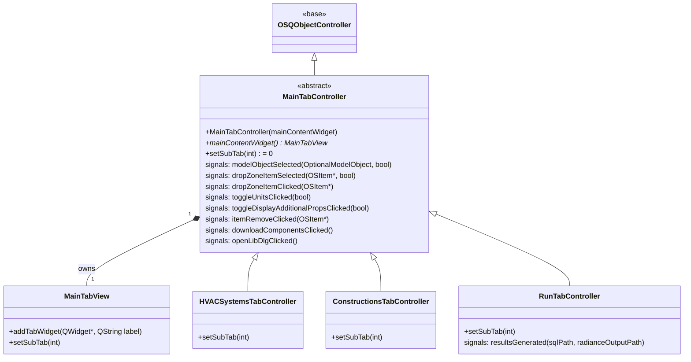

# Class: `MainTabController`

> **Module:** `openstudio_lib`  
> **Header:** [src/openstudio_lib/MainTabController.hpp](../../../../src/openstudio_lib/MainTabController.hpp)  
> **Library doc:** [libraries/openstudio_lib.md](../../libraries/openstudio_lib.md)

## Purpose

`MainTabController` is the abstract base class for every domain tab controller. A tab controller is responsible for:
- Creating and owning the domain's `MainTabView` (the central content widget)
- Implementing `setSubTab(int)` to switch between sub-tabs within the domain
- Forwarding model-object selection events, drag-and-drop zone interactions, and unit toggle signals up to `OSDocument` via signals

Concrete sub-classes include `HVACSystemsTabController`, `ConstructionsTabController`, `SchedulesTabController`, `RunTabController`, etc. Each follows the pattern: construct the domain view in the constructor, populate it with sub-views, and emit signals when the user interacts with model objects.

---

## Class Diagram

---

## Constructor

| Parameter | Type | Description |
|---|---|---|
| `mainContentWidget` | `MainTabView*` | The tab view owned by this controller |

---

## Key Public Methods

| Method | Returns | Description |
|---|---|---|
| `mainContentWidget()` | `MainTabView*` | The view managed by this controller |
| `setSubTab(int index)` | `void` | **Pure virtual** — switch to sub-tab at `index`. Implemented by each domain controller |

---

## Qt Signals

| Signal | Arguments | Description |
|---|---|---|
| `modelObjectSelected` | `model::OptionalModelObject, bool readOnly` | Emitted when the user selects a model object; triggers the right-column inspector |
| `dropZoneItemSelected` | `OSItem*, bool readOnly` | Emitted when an item in a drop zone is selected |
| `dropZoneItemClicked` | `OSItem*` | Emitted on click (without necessarily selecting a different inspector) |
| `toggleUnitsClicked` | `bool displayIP` | Relays the IP/SI toggle from the view to the document |
| `toggleDisplayAdditionalPropsClicked` | `bool` | Relays the additional properties toggle |
| `itemRemoveClicked` | `OSItem*` | Emitted when the remove (×) button on an item is clicked |
| `downloadComponentsClicked` | — | Triggers opening the BCL component browser |
| `openLibDlgClicked` | — | Triggers opening the library selection dialog |

---

## Implementing a New Tab Controller

To add a new domain tab:

1. Create a class that extends `MainTabController`
2. In the constructor, create the domain `MainTabView` and pass it to `MainTabController(view)`
3. Override `setSubTab(int)` to switch sub-views
4. Connect domain-specific interactions to the inherited signals above
5. Register the new tab in `OSDocument` by creating the controller and calling `MainWindow::addVerticalTabButton()`

See [developer/doc/AddingHVACComponentsToGUI.md](../../AddingHVACComponentsToGUI.md) for a detailed walkthrough.
