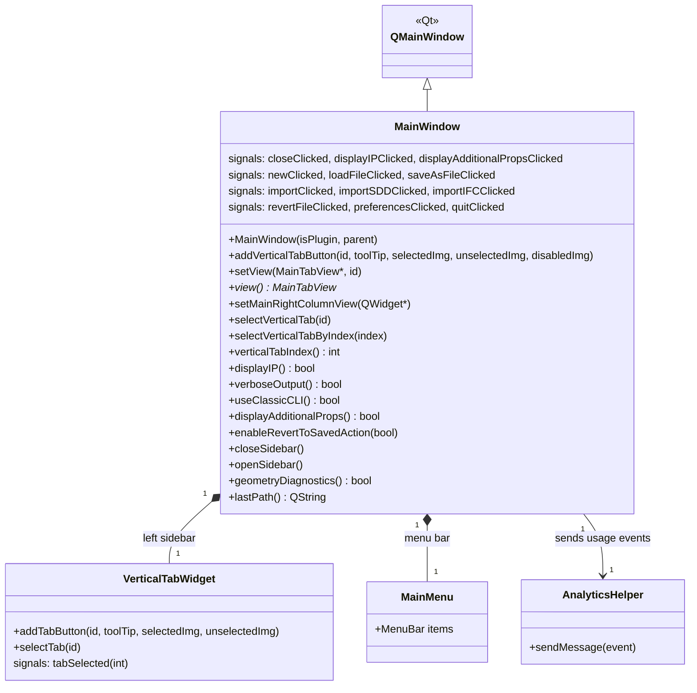

# Class: `MainWindow`

> **Module:** `openstudio_lib`  
> **Header:** [src/openstudio_lib/MainWindow.hpp](../../../../src/openstudio_lib/MainWindow.hpp)  
> **Library doc:** [libraries/openstudio_lib.md](../../libraries/openstudio_lib.md)

## Purpose

`MainWindow` is the application's top-level `QMainWindow`. It owns the vertical tab bar on the left side (which switches between domains like Geometry, HVAC, Schedules, etc.), the central tab content area, and the right-column inspector/library sidebar.

`OSDocument` creates and owns one `MainWindow`. The main window is shown when a document opens and closed when the document closes.

---

## Class Diagram

---

## Constructor

| Parameter | Type | Description |
|---|---|---|
| `isPlugin` | `bool` | When `true`, hides the menu bar and adjusts layout for embedding in SketchUp |
| `parent` | `QWidget*` | Optional Qt parent widget |

---

## Key Public Methods

| Method | Returns | Description |
|---|---|---|
| `addVerticalTabButton(id, toolTip, ...)` | `void` | Adds a domain tab button to the left vertical tab bar |
| `setView(view, id)` | `void` | Replaces the central content area with the given `MainTabView` |
| `view()` | `MainTabView*` | Returns the currently displayed tab view |
| `setMainRightColumnView(widget)` | `void` | Sets the widget displayed in the right-column sidebar |
| `selectVerticalTab(id)` | `void` | Programmatically switches to the tab with the given ID |
| `verticalTabIndex()` | `int` | Returns the index of the currently selected tab |
| `displayIP()` | `bool` | Returns the current unit display preference (true = imperial) |
| `verboseOutput()` | `bool` | Returns whether verbose EnergyPlus output is requested |
| `useClassicCLI()` | `bool` | Returns whether the Ruby CLI (classic) is preferred over the C++ labs CLI |
| `displayAdditionalProps()` | `bool` | Returns whether additional properties columns are shown in grid views |
| `enableRevertToSavedAction(bool)` | `void` | Enables/disables the Revert menu action |
| `closeSidebar()` / `openSidebar()` | `void` | Collapses or expands the right-column sidebar |
| `geometryDiagnostics()` | `bool` | Returns whether geometry diagnostics mode is active |

---

## Qt Signals

| Signal | Arguments | Description |
|---|---|---|
| `closeClicked` | — | User clicked the window close button |
| `displayIPClicked` | `bool` | User toggled IP/SI unit display |
| `displayAdditionalPropsClicked` | `bool` | User toggled additional properties columns |
| `newClicked` | — | File → New |
| `loadFileClicked` | — | File → Open |
| `saveAsFileClicked` | — | File → Save As |
| `importClicked` | — | File → Import (OSM) |
| `importSDDClicked` | — | File → Import SDD |
| `importIFCClicked` | — | File → Import IFC |
| `revertFileClicked` | — | File → Revert to Saved |
| `preferencesClicked` | — | Edit → Preferences |
| `quitClicked` | — | File → Quit |
