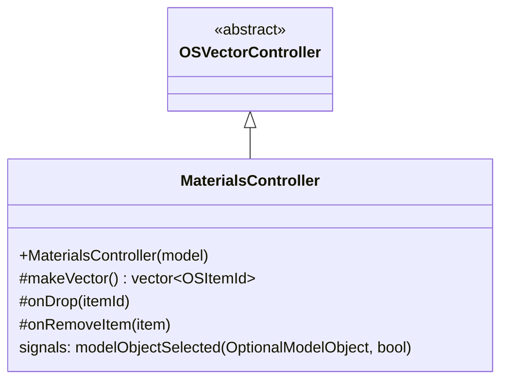

# Class: `MaterialsController`

> **Module:** `openstudio_lib`  
> **Header:** [src/openstudio_lib/MaterialsController.hpp](../../../../src/openstudio_lib/MaterialsController.hpp)  
> **Library doc:** [libraries/openstudio_lib.md](../../libraries/openstudio_lib.md)

## Purpose

`MaterialsController` manages the Materials sub-tab, listing all material objects in the model (opaque layer materials, glazing, window gas layers, blinds, screens, shades, etc.). Selecting a material in the list opens its type-specific inspector view in the right column.

Like `ConstructionsController`, it extends `OSVectorController` to supply its item list.

---

## Class Diagram

---

## Material Types Covered

`makeVector()` scans the model for all of the following IDD types and returns one `OSItemId` per object:

| Category | IDD Types |
|---|---|
| Opaque | `StandardOpaqueMaterial`, `MasslessOpaqueMaterial`, `RoofVegetation`, `AirGap` |
| Glazing | `SimpleGlazing`, `StandardGlazing`, `RefractionExtinctionGlazing`, `ThermochromicGlazing` |
| Window controls | `Blind`, `Screen`, `Shade`, `DaylightRedirectionDevice` |
| Gas layers | `Gas`, `GasMixture`, `GasCustom`, `AirWall` |

---

## Inspector View Pattern

`OSDocument` (or the parent tab controller) connects `modelObjectSelected` to `InspectorController`. The inspector then casts the `ModelObject` to its specific subtype and shows the matching inspector view (e.g., `StandardOpaqueMaterialInspectorView`, `SimpleGlazingInspectorView`).
