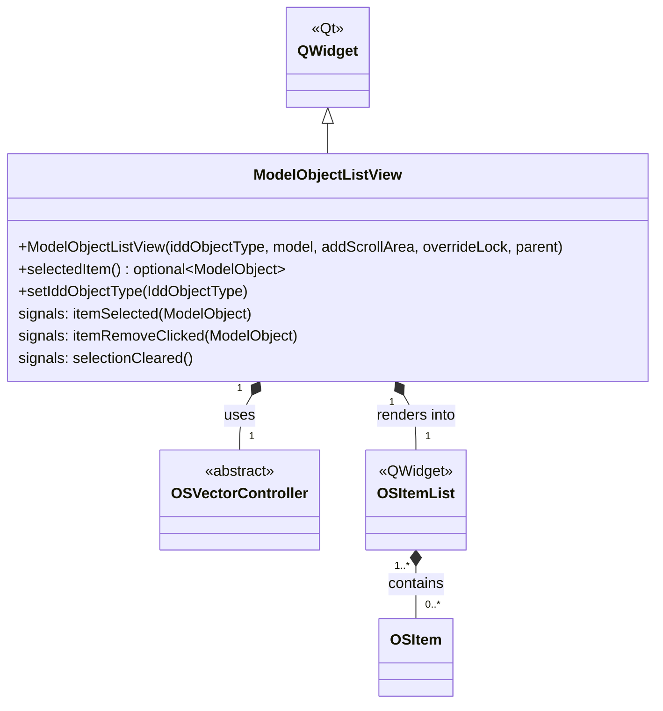

# Class: `ModelObjectListView`

> **Module:** `openstudio_lib`  
> **Header:** [src/openstudio_lib/ModelObjectListView.hpp](../../../../src/openstudio_lib/ModelObjectListView.hpp)  
> **Library doc:** [libraries/openstudio_lib.md](../../libraries/openstudio_lib.md)

## Purpose

`ModelObjectListView` is a generic list view for displaying any collection of model objects as `OSItem` rows. It is used throughout the application for the "My Model" tab contents — e.g., showing all space types, all constructions, all schedules — providing a simple way to browse and select model objects without a full grid view.

It wraps an `OSVectorController` to obtain its item list, and re-renders whenever the controller emits `itemIds`.

---

## Class Diagram

---

## Constructor

| Parameter | Type | Description |
|---|---|---|
| `iddObjectType` | `IddObjectType` | The IDD type of objects to display (e.g., `IddObjectType::OS_SpaceType`) |
| `model` | `model::Model` | The model to scan |
| `addScrollArea` | `bool` | Wraps the list in a `QScrollArea` when true |
| `overrideLock` | `bool` | When true, ignores field-lock policies (used in plugin mode) |
| `parent` | `QWidget*` | Qt parent |

---

## Key Public Methods

| Method | Returns | Description |
|---|---|---|
| `selectedItem()` | `optional<model::ModelObject>` | Returns the currently selected model object, if any |
| `setIddObjectType(type)` | `void` | Changes the object type being displayed; triggers a full refresh |

---

## Qt Signals

| Signal | Arguments | Description |
|---|---|---|
| `itemSelected` | `model::ModelObject` | Emitted when the user clicks an item; drives the right-column inspector |
| `itemRemoveClicked` | `model::ModelObject` | Emitted when the × button is clicked; the controller above handles deletion from the model |
| `selectionCleared` | — | Emitted when the selection is cleared (e.g., user clicks empty space) |
