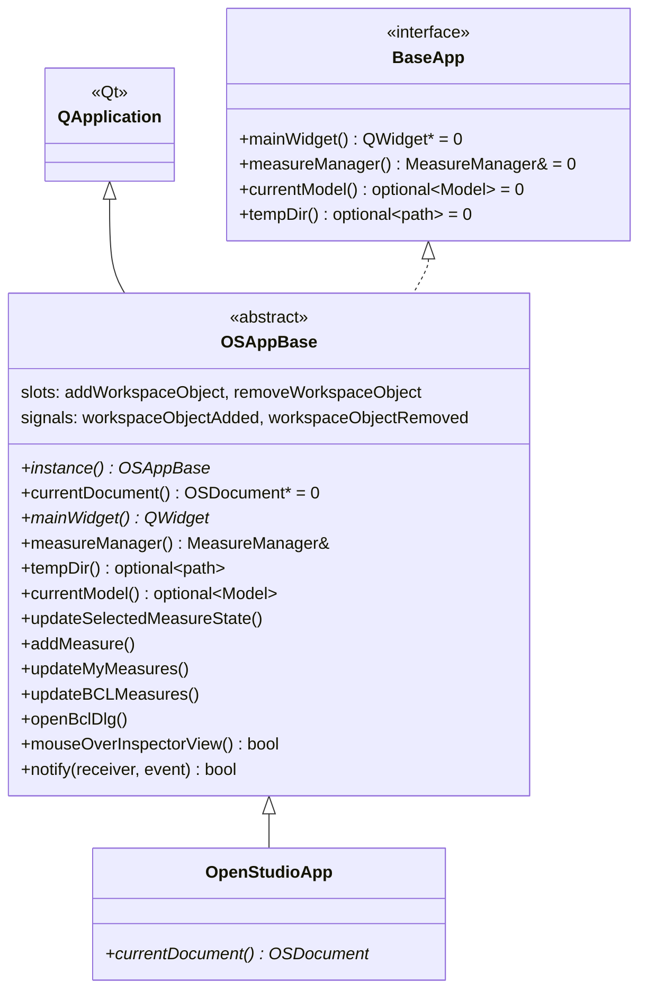

# Class: `OSAppBase`

> **Module:** `openstudio_lib`  
> **Header:** [src/openstudio_lib/OSAppBase.hpp](../../../../src/openstudio_lib/OSAppBase.hpp)  
> **Library doc:** [libraries/openstudio_lib.md](../../libraries/openstudio_lib.md)

## Purpose

`OSAppBase` is the abstract base class for the application object. It extends both `QApplication` and the `BaseApp` interface, providing a concrete implementation of measure management, workspace signal routing, and the static singleton accessor — while leaving `currentDocument()` abstract for the concrete subclass (`OpenStudioApp`) to implement.

This split allows the SketchUp plugin and standalone application to share all `MeasureManager`, BCL dialog, and workspace notification logic without duplicating it.

---

## Class Diagram

---

## Constructor

| Parameter | Type | Description |
|---|---|---|
| `argc` | `int&` | Passed through to `QApplication` |
| `argv` | `char**` | Passed through to `QApplication` |
| `t_measureManager` | `QSharedPointer<MeasureManager>` | Pre-constructed measure manager instance |

---

## Key Public Methods

| Method | Returns | Description |
|---|---|---|
| `instance()` | `OSAppBase*` | Returns the singleton application instance |
| `currentDocument()` | `shared_ptr<OSDocument>` | **Pure virtual** — implemented by `OpenStudioApp` |
| `mainWidget()` | `QWidget*` | Returns the main window widget of the current document |
| `measureManager()` | `MeasureManager&` | Returns the application-wide measure manager |
| `tempDir()` | `optional<path>` | Returns the path to a per-session temporary directory |
| `currentModel()` | `optional<Model>` | Returns the model from the current document, if one is open |
| `waitDialog()` | `shared_ptr<WaitDialog>` | Returns the shared "please wait" modal dialog |
| `mouseOverInspectorView()` | `bool` | Returns whether the mouse cursor is over the inspector view; used by `OSLineEdit2::focusOutEvent` to decide whether to keep focus |
| `dviewPath()` | `openstudio::path` | Returns the path to the DView results viewer |
| `notify(receiver, event)` | `bool` | Override of `QApplication::notify` — catches and logs C++ exceptions thrown inside Qt event handlers |

---

## Qt Signals

| Signal | Arguments | Description |
|---|---|---|
| `workspaceObjectAdded` | `WorkspaceObject, IddObjectType, UUID` | Forwarded from the current document's model; allows global listeners to react to any model object addition |
| `workspaceObjectAddedPtr` | `shared_ptr<WorkspaceObject_Impl>, IddObjectType, UUID` | Pointer variant for performance-sensitive listeners |
| `workspaceObjectRemoved` | `WorkspaceObject, IddObjectType, UUID` | Forwarded from the current document's model |
| `workspaceObjectRemovedPtr` | `shared_ptr<WorkspaceObject_Impl>, IddObjectType, UUID` | Pointer variant |

---

## Qt Slots

| Slot | Arguments | Description |
|---|---|---|
| `addWorkspaceObject` | `WorkspaceObject, IddObjectType, UUID` | Connected to the model's object-added signal; re-emits as `workspaceObjectAdded` |
| `addWorkspaceObjectPtr` | `shared_ptr<WorkspaceObject_Impl>, ...` | Pointer variant |
| `removeWorkspaceObject` | `WorkspaceObject, IddObjectType, UUID` | Connected to the model's object-removed signal; re-emits as `workspaceObjectRemoved` |
| `removeWorkspaceObjectPtr` | `shared_ptr<WorkspaceObject_Impl>, ...` | Pointer variant |

---

## Key Data Members

| Member | Type | Description |
|---|---|---|
| `m_measureManager` | `QSharedPointer<MeasureManager>` | Shared measure management instance |
| `m_waitDialog` | `boost::shared_ptr<WaitDialog>` | Application-wide modal progress dialog |
