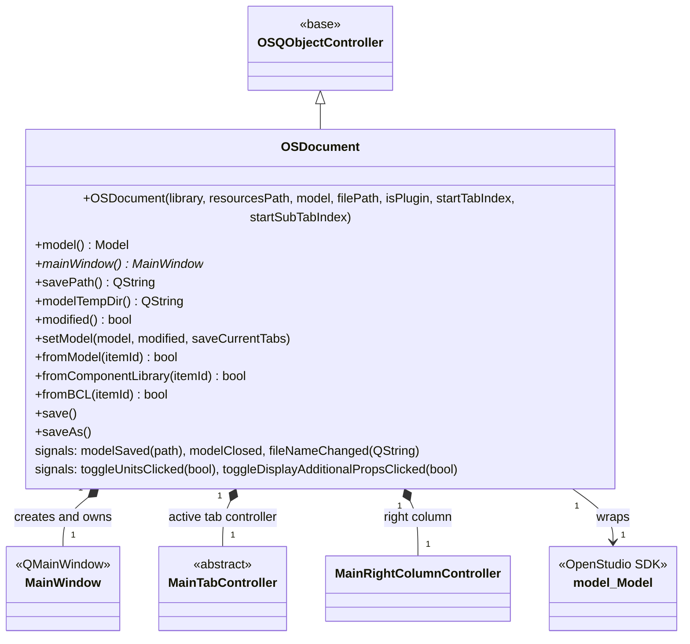

# Class: `OSDocument`

> **Module:** `openstudio_lib`  
> **Header:** [src/openstudio_lib/OSDocument.hpp](../../../../src/openstudio_lib/OSDocument.hpp)  
> **Library doc:** [libraries/openstudio_lib.md](../../libraries/openstudio_lib.md)

## Purpose

`OSDocument` is the central document class of the application. It owns exactly one `openstudio::model::Model` and orchestrates the entire GUI around it: it creates the `MainWindow`, instantiates all tab controllers, and connects model change signals to view updates.

It corresponds to an open `.osm` file. When the user creates a new model or opens an existing one, a new `OSDocument` is constructed; when they close it, the `OSDocument` is destroyed along with all tabs and views.

---

## Class Diagram

---

## Constructor

| Parameter | Type | Description |
|---|---|---|
| `library` | `model::Model` | Component library model used for drag-and-drop into the document |
| `resourcesPath` | `openstudio::path` | Path to application resources (icons, default files) |
| `model` | `model::OptionalModel` | Initial model to display; if empty, a new blank model is created |
| `filePath` | `QString` | Path of the file on disk; empty for new unsaved models |
| `isPlugin` | `bool` | `true` when hosted inside the SketchUp plugin (modifies layout) |
| `startTabIndex` | `int` | Which tab to show initially (0 = Site / Geometry) |
| `startSubTabIndex` | `int` | Which sub-tab to select within the initial tab |

---

## Key Public Methods

| Method | Returns | Description |
|---|---|---|
| `mainWindow()` | `MainWindow*` | The top-level `QMainWindow` associated with this document |
| `model()` | `model::Model` | The current OpenStudio model |
| `setModel(model, modified, saveCurrentTabs)` | `void` | Replaces the model (used after version translation, format import); saves and restores tab index |
| `modified()` | `bool` | `true` if the model has unsaved changes |
| `savePath()` | `QString` | Absolute path to the saved `.osm` file; empty if unsaved |
| `modelTempDir()` | `QString` | Path to the temporary working directory for this document's resources |
| `componentLibrary()` | `model::Model` | The component library model |
| `setComponentLibrary(model)` | `void` | Replaces the component library |
| `fromModel(itemId)` | `bool` | Returns `true` if the `OSItemId` refers to an object in the current model |
| `fromComponentLibrary(itemId)` | `bool` | Returns `true` if the `OSItemId` refers to an object in the component library |
| `fromBCL(itemId)` | `bool` | Returns `true` if the `OSItemId` refers to a BCL component |
| `save()` | `bool` | Saves to the current `savePath()`; prompts "Save As" if unsaved |
| `saveAs()` | `bool` | Opens a file dialog for Save As |

---

## Qt Signals

| Signal | Arguments | Description |
|---|---|---|
| `modelSaved` | `openstudio::path` | Emitted after a successful save, with the saved path |
| `modelClosed` | — | Emitted just before the document is destroyed |
| `fileNameChanged` | `QString` | Emitted when the save path changes (new save or Save As) |
| `toggleUnitsClicked` | `bool displayIP` | Relays the "Display IP/SI units" toggle from `MainWindow` to all tab views |
| `toggleDisplayAdditionalPropsClicked` | `bool` | Relays the "additional properties" visibility toggle |
| `treeChanged` | `openstudio::UUID` | Emitted when the model object hierarchy changes |

---

## Key Data Members

| Member | Type | Description |
|---|---|---|
| `m_model` | `model::Model` | The OpenStudio model being edited |
| `m_mainWindow` | `MainWindow*` | The document's top-level window |
| `m_mainTabController` | pointer to active controller | The currently displayed tab controller |
| `m_mainRightColumnController` | `MainRightColumnController*` | The right inspector/library column controller |
| `m_savePath` | `QString` | Current file path on disk |
| `m_modified` | `bool` | Dirty flag |
| `m_isPlugin` | `bool` | Whether hosted in SketchUp plugin mode |
