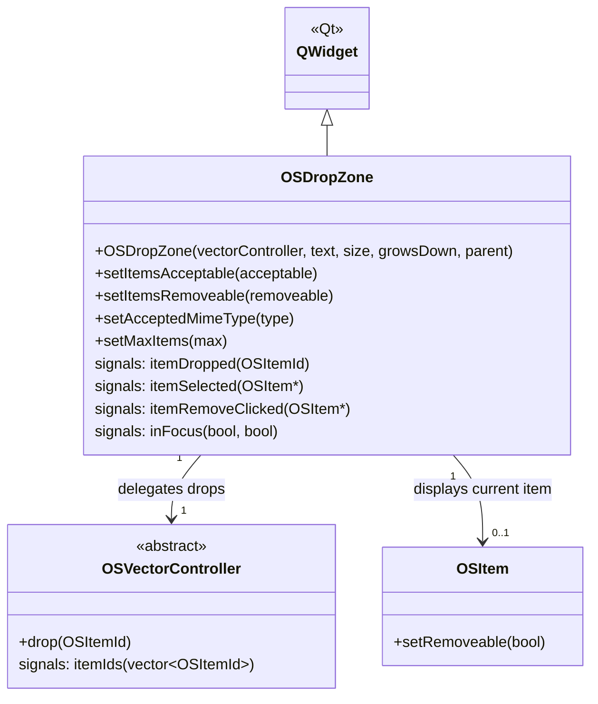

# Class: `OSDropZone`

> **Module:** `openstudio_lib`  
> **Header:** [src/openstudio_lib/OSDropZone.hpp](../../../../src/openstudio_lib/OSDropZone.hpp)  
> **Library doc:** [libraries/openstudio_lib.md](../../libraries/openstudio_lib.md)

## Purpose

`OSDropZone` is a widget that displays a single `OSItem` (or a placeholder when empty) and accepts drag-and-drop of model objects onto it. It is the standard UI element for one-to-one model relationships — e.g., "the heating coil for this air loop terminal", or "the schedule for this lights definition".

When a user drags an item from a list and drops it onto an `OSDropZone`, the drop zone routes the event through its associated `OSVectorController`.

---

## Class Diagram



---

## Constructor

| Parameter | Type | Description |
|---|---|---|
| `vectorController` | `OSVectorController*` | The controller managing the underlying model relationship |
| `text` | `QString` | Placeholder text shown when the zone is empty |
| `size` | `QSize` | Preferred size |
| `growsDown` | `bool` | If true, multiple items can be stacked vertically (acts as a multi-item zone) |
| `parent` | `QWidget*` | Qt parent |

---

## Key Public Methods

| Method | Returns | Description |
|---|---|---|
| `setItemsAcceptable(bool)` | `void` | Whether drops are currently accepted (may be disabled e.g. when a field is locked) |
| `setItemsRemoveable(bool)` | `void` | Whether the remove button is shown on the displayed item |
| `setAcceptedMimeType(QString)` | `void` | Restricts accepted drops to items with the given MIME type (object type filter) |
| `setMaxItems(int)` | `void` | Caps the number of items when `growsDown` is true |

---

## Qt Signals

| Signal | Arguments | Description |
|---|---|---|
| `itemDropped` | `OSItemId` | Emitted when a valid item is dropped; forwarded to the vector controller's `drop()` slot |
| `itemSelected` | `OSItem*` | Emitted when the displayed item is clicked |
| `itemRemoveClicked` | `OSItem*` | Emitted when the × button is clicked on the current item |
| `inFocus` | `bool focused, bool readOnly` | Emitted when the drop zone gains or loses focus (used to update the right-column inspector) |

---

## Usage Pattern

`OSDropZone` is typically used inside an inspector view for a single-object relationship:

```cpp
// In some inspector constructor:
auto ctrl = new MyRelationshipVectorController(m_model);
auto dropZone = new OSDropZone(ctrl, "Drop Coil Here");
connect(dropZone, &OSDropZone::itemSelected,
        this, &MyInspectorView::onItemSelected);
layout->addWidget(dropZone);
```

For multi-item ordered lists, use `OSItemList` or `OSDropZone` with `growsDown = true`.
