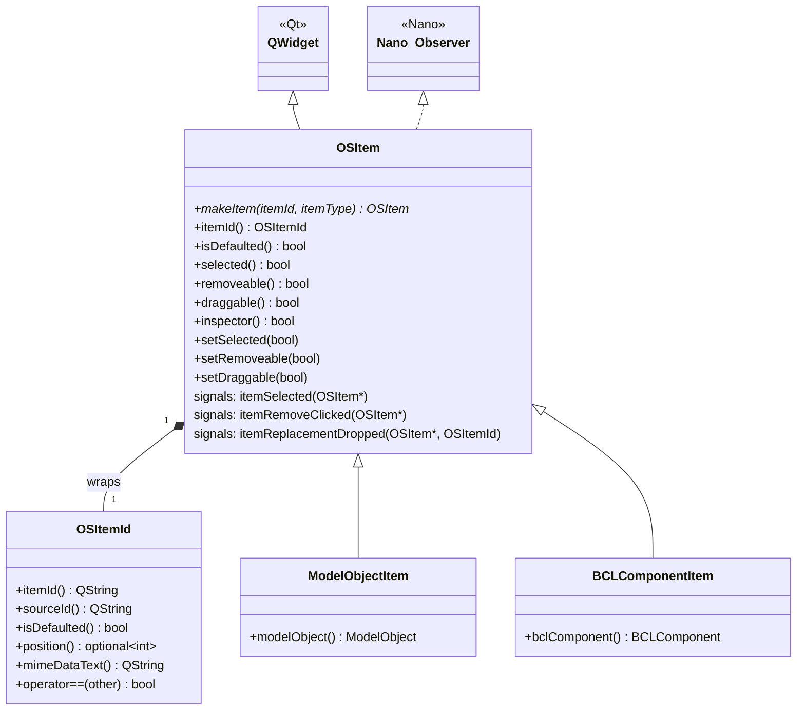

# Class: `OSItem`

> **Module:** `openstudio_lib`  
> **Header:** [src/openstudio_lib/OSItem.hpp](../../../../src/openstudio_lib/OSItem.hpp)  
> **Library doc:** [libraries/openstudio_lib.md](../../libraries/openstudio_lib.md)

## Purpose

`OSItem` is the base class for all draggable, selectable model object items rendered in the application's lists, drop zones, and library panels. It wraps an `OSItemId` (a lightweight identifier for a model object or BCL component) and provides the visual representation plus drag-and-drop support.

`OSItemId` is a companion value type that identifies an item by its model object UUID (or BCL identifier), its source (model, component library, or BCL), and optional positional information.

---

## Class Diagram

---

## `OSItemId` Value Type

| Method | Returns | Description |
|---|---|---|
| `itemId()` | `QString` | The UUID string of the underlying model object, or BCL identifier |
| `sourceId()` | `QString` | Identifies the source: model, component library, or `BCL_SOURCE_ID` |
| `isDefaulted()` | `bool` | True if this item represents a default (inherited) value |
| `position()` | `optional<int>` | Positional index within an ordered list (e.g., construction layer) |
| `mimeDataText()` | `QString` | Full serialized representation for Qt drag-and-drop MIME data |

---

## Key Public Methods

| Method | Returns | Description |
|---|---|---|
| `makeItem(itemId, itemType)` | `OSItem*` (static) | Factory: creates the appropriate `OSItem` subclass for the given item ID and display type |
| `itemId()` | `OSItemId` | The underlying item identifier |
| `selected()` | `bool` | Whether this item is currently selected (highlighted) |
| `setSelected(bool)` | `void` | Selects/deselects this item; triggers visual update |
| `removeable()` | `bool` | Whether the remove (×) button is visible |
| `setRemoveable(bool)` | `void` | Shows/hides the remove button |
| `draggable()` | `bool` | Whether the item can be dragged |
| `inspector()` | `bool` | Whether clicking this item opens the right-column inspector |

---

## Qt Signals

| Signal | Arguments | Description |
|---|---|---|
| `itemSelected` | `OSItem*` | Emitted when the item is clicked/selected |
| `itemRemoveClicked` | `OSItem*` | Emitted when the × remove button is clicked |
| `itemReplacementDropped` | `OSItem* current, OSItemId replacement` | Emitted when another item is dropped onto this one, triggering a replace operation |

---

## `OSItemType` Enum

Controls which visual style is applied to the item:

| Value | Appearance |
|---|---|
| `ListItem` | Full-width horizontal bar with label |
| `DropzoneSquare` | Square compact tile for drop zones |
| `CollapsibleListHeader` | Header row for collapsible sections |
