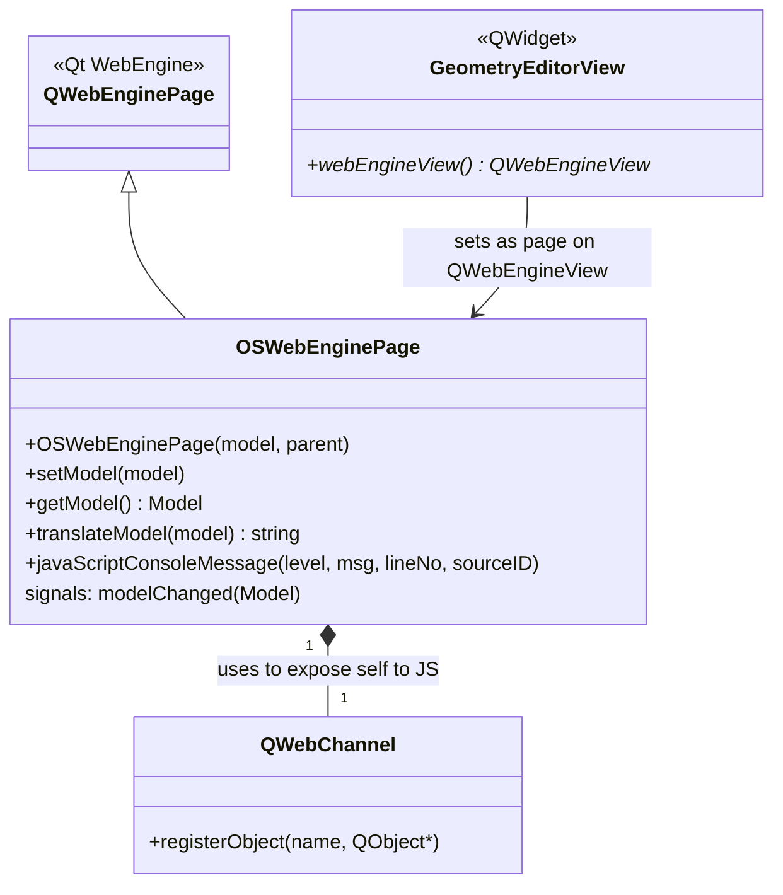

# Class: `OSWebEnginePage`

> **Module:** `openstudio_lib`  
> **Header:** [src/openstudio_lib/OSWebEnginePage.hpp](../../../../src/openstudio_lib/OSWebEnginePage.hpp)  
> **Library doc:** [libraries/openstudio_lib.md](../../libraries/openstudio_lib.md)

## Purpose

`OSWebEnginePage` is a `QWebEnginePage` subclass that serves as the C++/JavaScript bridge for the geometry editor. It exposes a Qt-registered C++ object to the JavaScript engine so the web-based 3D geometry editor can read and write the OpenStudio model.

The bridge is established via Qt WebChannel (`QWebChannel`), which makes the registered C++ object callable from JavaScript as if it were a native JS object.

---

## Class Diagram

---

## Constructor

| Parameter | Type | Description |
|---|---|---|
| `model` | `const model::Model&` | Initial model whose geometry is serialised and sent to the JS engine |
| `parent` | `QObject*` | Qt parent |

---

## Key Public Methods

| Method | Returns | Description |
|---|---|---|
| `setModel(model)` | `void` | Serialises the model geometry to GLTF JSON and sends it to the JavaScript engine via `runJavaScript()` |
| `getModel()` | `model::Model` | Returns the current model maintained on the C++ side |
| `translateModel(model)` | `std::string` | Converts an `openstudio::model::Model` to a GLTF JSON string (uses TinyGLTF) |

---

## Qt Signals

| Signal | Arguments | Description |
|---|---|---|
| `modelChanged` | `model::Model` | Emitted when the JavaScript editor sends back geometry changes; carries the updated model |

---

## JavaScript Bridge API

The following slots are exposed to JavaScript via `QWebChannel` under the registered object name `"openstudioApi"`:

| JS-callable slot | C++ signature | Description |
|---|---|---|
| `getFloorplanJS()` | `Q_INVOKABLE QString getFloorplanJS()` | Returns the current model geometry as a floorplan JSON string |
| `setFloorplanJS(json)` | `Q_INVOKABLE void setFloorplanJS(QString)` | Receives updated floorplan JSON from the JS editor; deserialises into the model |
| `getGLTF()` | `Q_INVOKABLE QString getGLTF()` | Returns GLTF geometry JSON |
| `setGLTF(json)` | `Q_INVOKABLE void setGLTF(QString)` | Receives GLTF from the JS editor |

---

## Console Message Logging

`javaScriptConsoleMessage()` is overridden to forward JavaScript `console.log`/`console.error` messages to the C++ logger, making JavaScript errors visible in the application's debug output.
