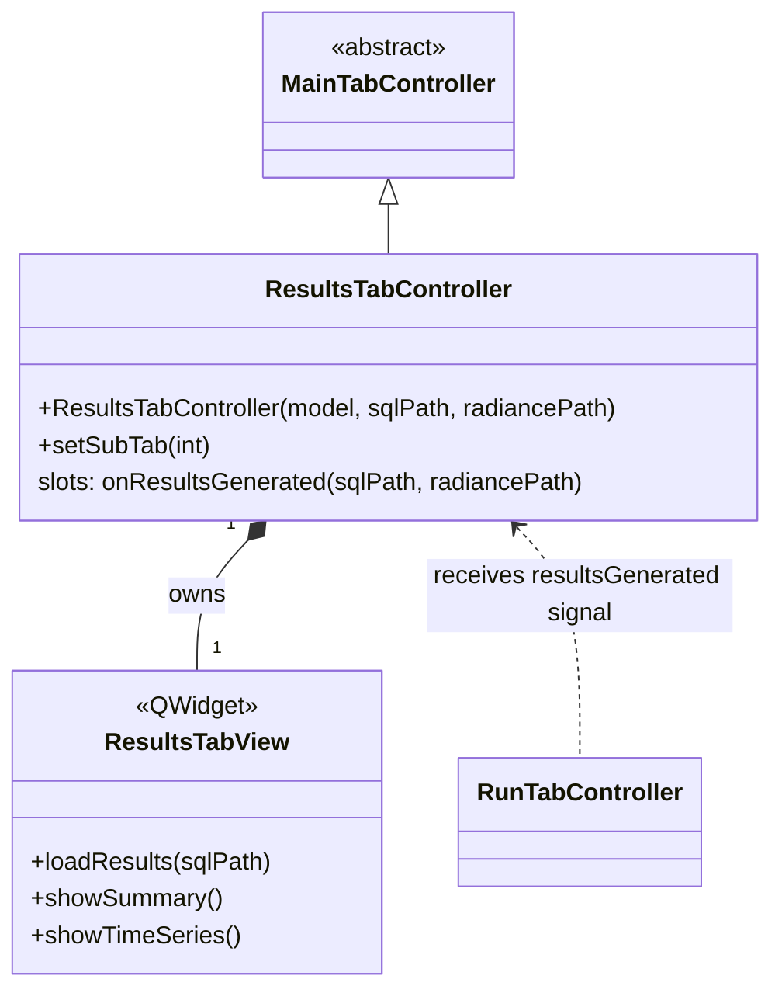

# Class: `ResultsTabController`

> **Module:** `openstudio_lib`  
> **Header:** [src/openstudio_lib/ResultsTabController.hpp](../../../../src/openstudio_lib/ResultsTabController.hpp)  
> **Library doc:** [libraries/openstudio_lib.md](../../libraries/openstudio_lib.md)

## Purpose

`ResultsTabController` manages the Results tab. After a simulation completes, `RunTabController` emits `resultsGenerated(sqlPath)`, which this controller receives to load and display the SQL results database.

The results view shows:
- Summary metrics (site energy use intensity, end-use breakdown)
- Time-series charts for user-selected output variables
- Optional links to DView for advanced charting

---

## Class Diagram

---

## Qt Slots

| Slot | Arguments | Description |
|---|---|---|
| `onResultsGenerated` | `openstudio::path sqlFile, openstudio::path radianceOutputFile` | Loads the SQL results database and re-populates the results views. Connected to `RunTabController::resultsGenerated`. |

---

## Results View Content

The `ResultsTabView` uses `QtCharts` to render:
- **End-use bar chart** — energy by end use (heating, cooling, lighting, equipment, fans, pumps, etc.)
- **Time-series chart** — selectable EnergyPlus output variable over the run period
- **Utility summary table** — site EUI, source EUI, annual cost estimate
