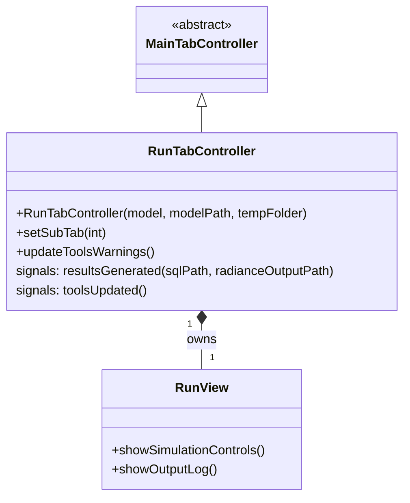
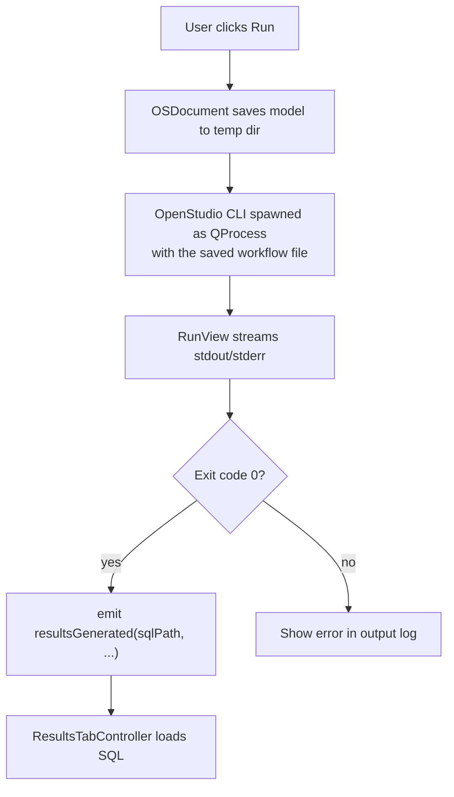

# Class: `RunTabController`

> **Module:** `openstudio_lib`  
> **Header:** [src/openstudio_lib/RunTabController.hpp](../../../../src/openstudio_lib/RunTabController.hpp)  
> **Library doc:** [libraries/openstudio_lib.md](../../libraries/openstudio_lib.md)

## Purpose

`RunTabController` manages the Run tab, which allows users to run an EnergyPlus simulation of the current model and monitor live output from the simulation process. When the simulation completes, it emits a signal with the path to the SQL results file, which triggers the Results tab to load them.

---

## Class Diagram

---

## Constructor

| Parameter | Type | Description |
|---|---|---|
| `model` | `const model::Model&` | Current model to simulate |
| `t_modelPath` | `const openstudio::path&` | Path to the saved `.osm` file |
| `t_tempFolder` | `const openstudio::path&` | Temporary working directory for simulation files |

---

## Qt Signals

| Signal | Arguments | Description |
|---|---|---|
| `resultsGenerated` | `openstudio::path sqlFile, openstudio::path radianceOutputFile` | Emitted when the simulation completes successfully; drives the Results tab to load the SQL database |
| `toolsUpdated` | — | Emitted when EnergyPlus/Radiance tool paths change; may trigger warning banner updates |

---

## Qt Slots

| Slot | Description |
|---|---|
| `updateToolsWarnings()` | Checks whether EnergyPlus and Radiance are correctly located and updates any warning badges on the Run tab button |

---

## Run Workflow

