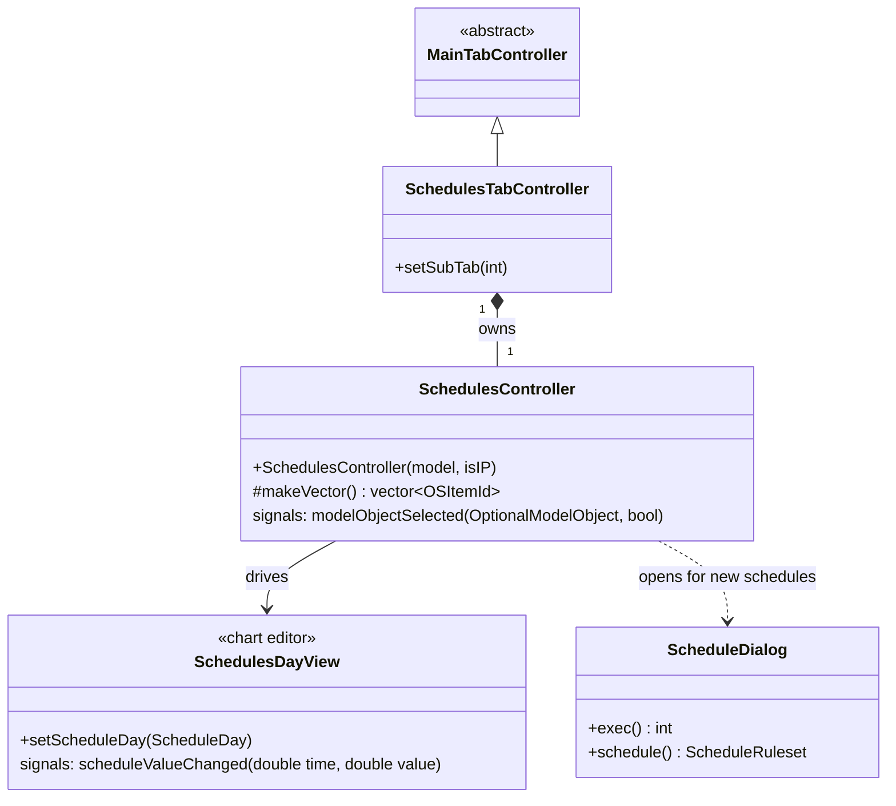

# Class: `SchedulesController`

> **Module:** `openstudio_lib`  
> **Header:** [src/openstudio_lib/SchedulesController.hpp](../../../../src/openstudio_lib/SchedulesController.hpp)  
> **Library doc:** [libraries/openstudio_lib.md](../../libraries/openstudio_lib.md)

## Purpose

`SchedulesController` manages the Schedules domain tab. It displays a tree of schedule rule sets and schedule types, and provides a `ScheduleDayView` inspector that lets users graphically edit day-profile values with a chart-based editor.

---

## Class Diagram

---

## Day Schedule Editor

The `SchedulesDayView` provides a graphical plot of a schedule day profile:
- X axis: time of day (00:00–24:00)
- Y axis: fractional value or absolute value (depending on schedule type limits)
- User can click and drag to set values at any time point
- Supports fractional interpolation and step profiles

---

## Schedule Types Shown

`makeVector()` returns all `ScheduleRuleset`, `ScheduleConstant`, `ScheduleCompact`, and `ScheduleFile` objects.

---

## Qt Signals

| Signal | Arguments | Description |
|---|---|---|
| `modelObjectSelected` | `OptionalModelObject, bool` | Emitted when a schedule is selected; drives the day-schedule editor |
