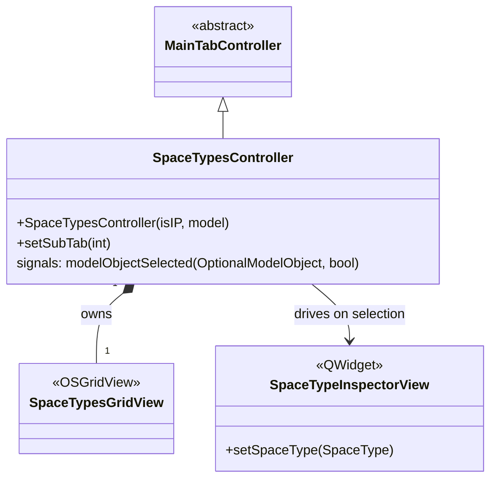

# Class: `SpaceTypesController`

> **Module:** `openstudio_lib`  
> **Header:** [src/openstudio_lib/SpaceTypesController.hpp](../../../../src/openstudio_lib/SpaceTypesController.hpp)  
> **Library doc:** [libraries/openstudio_lib.md](../../libraries/openstudio_lib.md)

## Purpose

`SpaceTypesController` manages the Space Types tab, which shows all space type objects in the model in a grid view. Each row is a space type; columns show its name, default construction set, default schedule set, lighting power density, people density, equipment, outdoor air, and rendering color.

It is a `MainTabController` subclass that owns a `SpaceTypesGridView` powered by a domain-specific `OSGridController`.

---

## Class Diagram

---

## Grid Columns

The `SpaceTypesGridController` defines these columns (not exhaustive):

| Column | Field |
|---|---|
| Name | `SpaceType::name()` |
| Default Construction Set | `SpaceType::defaultConstructionSet()` |
| Default Schedule Set | `SpaceType::defaultScheduleSet()` |
| Space Type Color | `SpaceType::renderingColor()` |
| Lighting Power Density | `SpaceType::lightingPowerDensity()` |
| People Definition | `SpaceType::people()` |
| Outdoor Air | `SpaceType::designSpecificationOutdoorAir()` |
