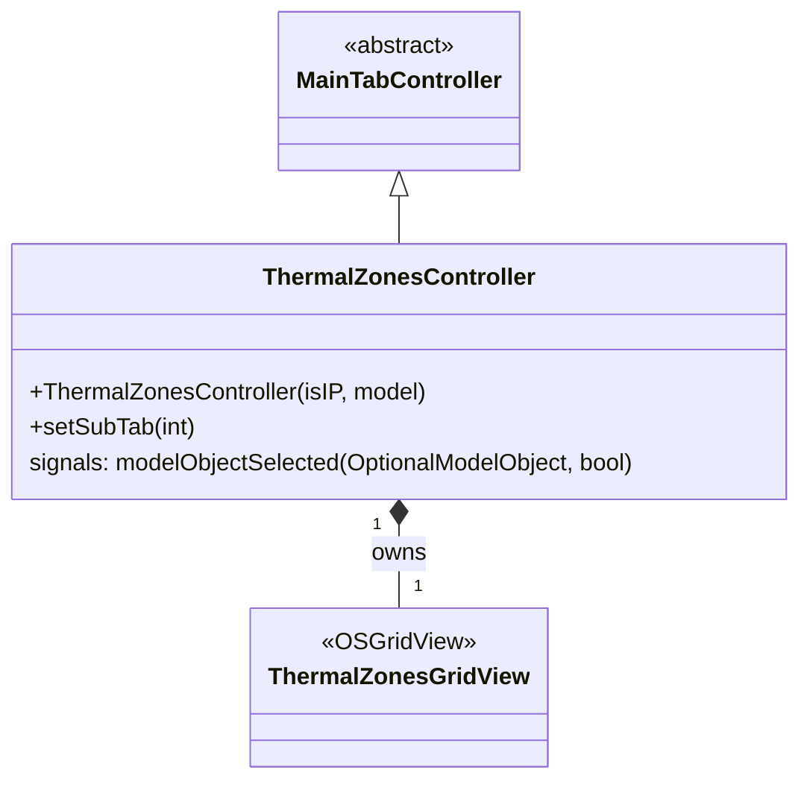

# Class: `ThermalZonesController`

> **Module:** `openstudio_lib`  
> **Header:** [src/openstudio_lib/ThermalZonesController.hpp](../../../../src/openstudio_lib/ThermalZonesController.hpp)  
> **Library doc:** [libraries/openstudio_lib.md](../../libraries/openstudio_lib.md)

## Purpose

`ThermalZonesController` manages the Thermal Zones tab, showing all thermal zone objects in the model in a grid view. Each row represents one zone; columns expose thermostat types, humidistats, zone multipliers, cooling/heating ideal air loads, zone equipment, and DOAS connections.

---

## Class Diagram

---

## Grid Columns (representative)

| Column | Field |
|---|---|
| Name | `ThermalZone::name()` |
| Thermostat | `ThermalZone::thermostat()` |
| Humidistat | `ThermalZone::zoneControlHumidistat()` |
| Multiplier | `ThermalZone::multiplier()` |
| Use Ideal Air Loads | `ThermalZone::useIdealAirLoads()` |
| DOAS Airloop | `ThermalZone::airLoopHVAC()` |
| Zone Conditioning Equip | `ThermalZone::equipment()` |
| Rendering Color | `ThermalZone::renderingColor()` |
