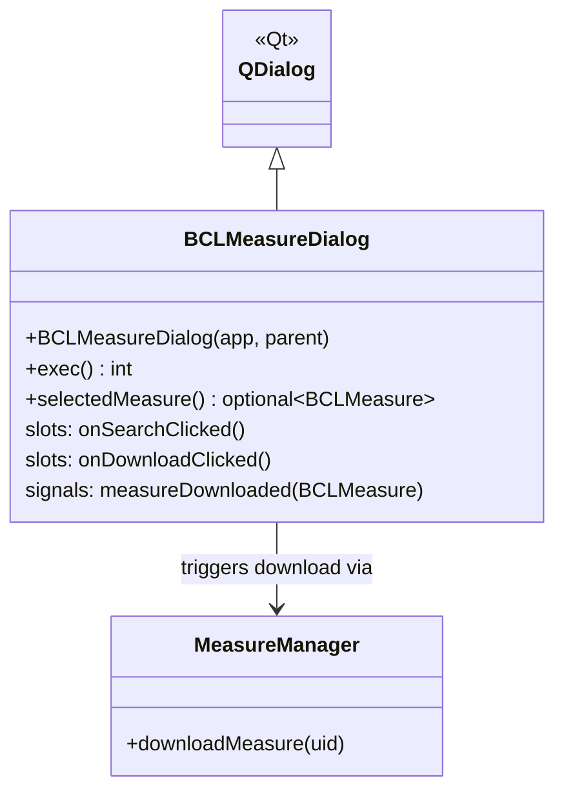

# Class: `BCLMeasureDialog`

> **Module:** `shared_gui_components`  
> **Header:** [src/shared_gui_components/BCLMeasureDialog.hpp](../../../../src/shared_gui_components/BCLMeasureDialog.hpp)  
> **Library doc:** [libraries/shared_gui_components.md](../../libraries/shared_gui_components.md)

## Purpose

`BCLMeasureDialog` is a modal dialog that lets users search and download OpenStudio Measures from the NREL Building Component Library (BCL). It queries the BCL REST API, displays results with taxonomy filtering and free-text search, and downloads selected measures to the local BCL cache.

---

## Class Diagram

---

## Constructor

| Parameter | Type | Description |
|---|---|---|
| `app` | `BaseApp*` | Application interface for accessing `MeasureManager` |
| `parent` | `QWidget*` | Qt parent |

---

## Key Public Methods

| Method | Returns | Description |
|---|---|---|
| `exec()` | `int` | Shows the dialog modally; returns `QDialog::Accepted` if the user downloaded a measure |
| `selectedMeasure()` | `optional<BCLMeasure>` | Returns the last downloaded/selected measure after `exec()` returns |

---

## Qt Signals

| Signal | Arguments | Description |
|---|---|---|
| `measureDownloaded` | `BCLMeasure` | Emitted when a measure is successfully downloaded to the local cache |
