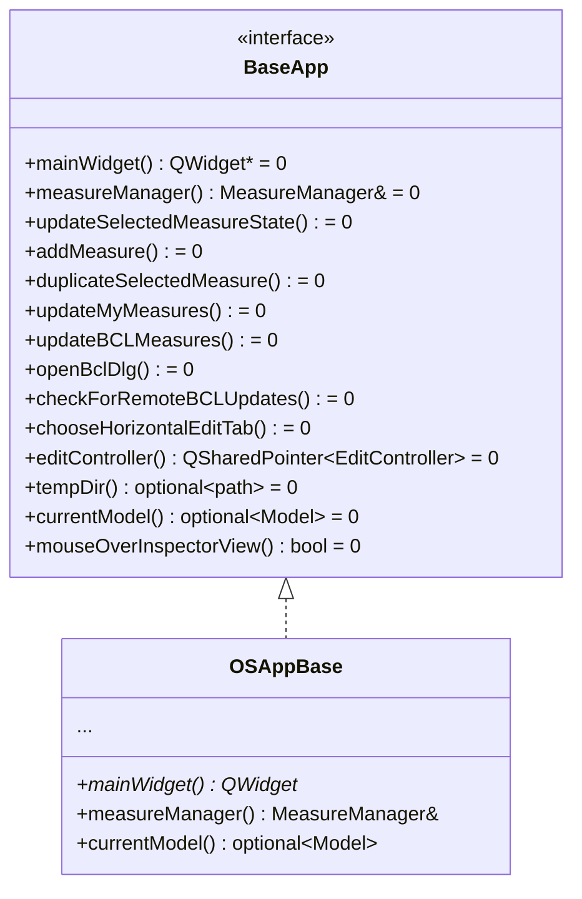

# Class: `BaseApp`

> **Module:** `shared_gui_components`  
> **Header:** [src/shared_gui_components/BaseApp.hpp](../../../../src/shared_gui_components/BaseApp.hpp)  
> **Library doc:** [libraries/shared_gui_components.md](../../libraries/shared_gui_components.md)

## Purpose

`BaseApp` is a pure abstract interface that decouples all shared GUI components from any specific application implementation. Widgets like `MeasureManager`, `LocalLibraryController`, and `BuildingComponentDialog` depend only on `BaseApp`, not on `OSAppBase` or `OpenStudioApp`. This isolation enables the shared components to be hosted inside the SketchUp plugin or any other Qt host without modification.

`OSAppBase` implements `BaseApp`, satisfying the contract for both the standalone application and plugin contexts.

---

## Class Diagram

---

## Abstract Methods

| Method | Returns | Description |
|---|---|---|
| `mainWidget()` | `QWidget*` | The application's main window widget |
| `measureManager()` | `MeasureManager&` | Access to the application's measure manager |
| `updateSelectedMeasureState()` | `void` | Refresh the enable/disable state of measure-related actions |
| `addMeasure()` | `void` | Trigger the "Add Measure" workflow |
| `duplicateSelectedMeasure()` | `void` | Duplicate the currently selected measure |
| `updateMyMeasures()` | `void` | Re-scan the user's local measures directory |
| `updateBCLMeasures()` | `void` | Re-scan the BCL local cache |
| `openBclDlg()` | `void` | Open the BCL measure browser dialog |
| `checkForRemoteBCLUpdates()` | `void` | Query the BCL server for updated measures |
| `chooseHorizontalEditTab()` | `void` | Switch the right column to the Edit tab |
| `editController()` | `QSharedPointer<EditController>` | The right-column edit controller |
| `tempDir()` | `optional<path>` | Path to the session temporary directory |
| `currentModel()` | `optional<model::Model>` | The current model, if any |
| `mouseOverInspectorView()` | `bool` | Returns whether the mouse cursor is currently over the inspector view in the right column |
