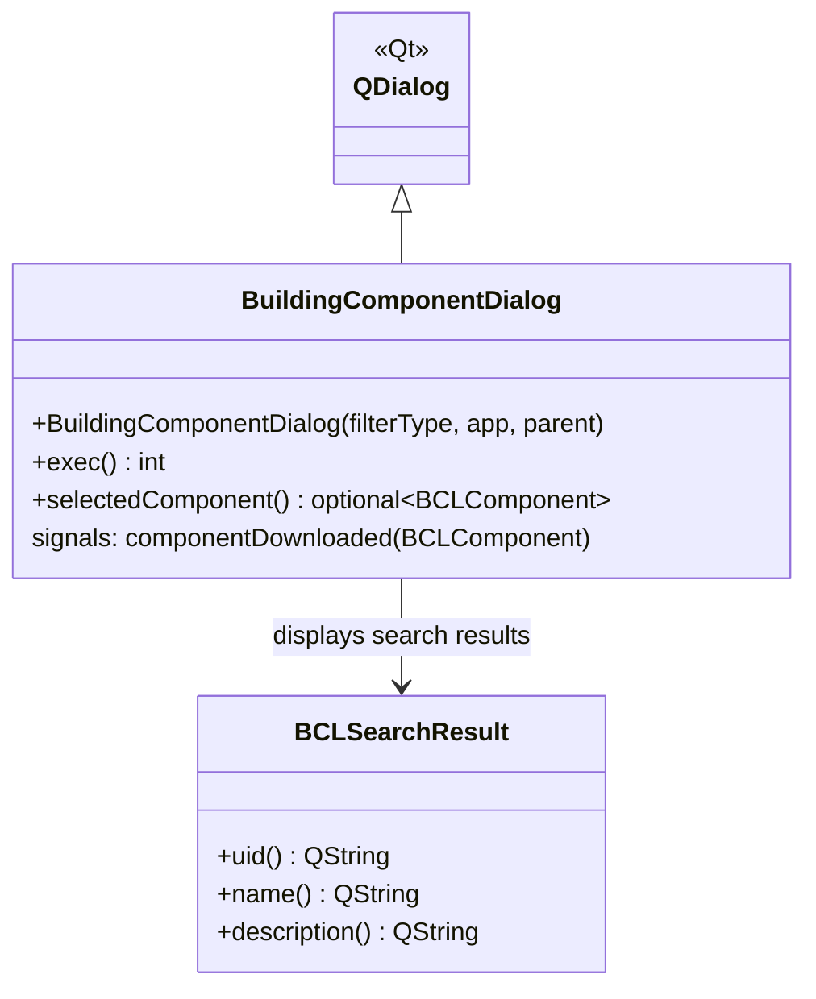

# Class: `BuildingComponentDialog`

> **Module:** `shared_gui_components`  
> **Header:** [src/shared_gui_components/BuildingComponentDialog.hpp](../../../../src/shared_gui_components/BuildingComponentDialog.hpp)  
> **Library doc:** [libraries/shared_gui_components.md](../../libraries/shared_gui_components.md)

## Purpose

`BuildingComponentDialog` is a modal dialog for browsing and downloading building components (constructions, materials, schedules, etc.) from the NREL Building Component Library (BCL). Once downloaded, the component is available for drag-and-drop into the relevant model views.

It is analogous to `BCLMeasureDialog` but targets BCL *components* rather than *measures*.

---

## Class Diagram

---

## Constructor

| Parameter | Type | Description |
|---|---|---|
| `filterType` | `QString` | BCL component type to filter results (e.g., `"Construction"`, `"Material"`) |
| `app` | `BaseApp*` | Application interface |
| `parent` | `QWidget*` | Qt parent |

---

## Key Public Methods

| Method | Returns | Description |
|---|---|---|
| `exec()` | `int` | Shows the dialog modally |
| `selectedComponent()` | `optional<BCLComponent>` | The downloaded component after `exec()` returns |

---

## Qt Signals

| Signal | Arguments | Description |
|---|---|---|
| `componentDownloaded` | `BCLComponent` | Emitted after a successful component download |
