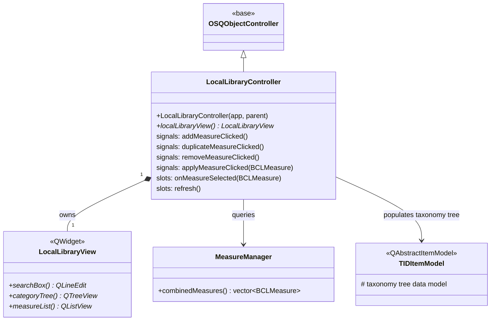

# Class: `LocalLibraryController`

> **Module:** `shared_gui_components`  
> **Header:** [src/shared_gui_components/LocalLibraryController.hpp](../../../../src/shared_gui_components/LocalLibraryController.hpp)  
> **Library doc:** [libraries/shared_gui_components.md](../../libraries/shared_gui_components.md)

## Purpose

`LocalLibraryController` manages the "Library" tab of the right-column sidebar. It provides a searchable, filterable browser of all locally available OpenStudio Measures (from both `myMeasures` and the BCL cache), organized by taxonomy category.

Users can browse, search, and select measures from this list; the selected measure can then be dragged into the workflow or applied immediately via `ApplyMeasureNowDialog`.

---

## Class Diagram

---

## Constructor

| Parameter | Type | Description |
|---|---|---|
| `app` | `BaseApp*` | Application interface for accessing `MeasureManager` |
| `parent` | `QObject*` | Qt parent |

---

## Key Public Methods

| Method | Returns | Description |
|---|---|---|
| `localLibraryView()` | `LocalLibraryView*` | The view widget to embed in the right-column sidebar |

---

## Qt Signals

| Signal | Arguments | Description |
|---|---|---|
| `addMeasureClicked` | — | User clicked the "Add Measure" button; opens the new measure wizard |
| `duplicateMeasureClicked` | — | User duplicated the selected measure |
| `removeMeasureClicked` | — | User deleted the selected measure from local disk |
| `applyMeasureClicked` | `BCLMeasure` | User pressed "Apply Now"; triggers `ApplyMeasureNowDialog` |

---

## Qt Slots

| Slot | Description |
|---|---|
| `onMeasureSelected(BCLMeasure)` | Updates the detail panel with the selected measure's metadata |
| `refresh()` | Rebuilds the taxonomy tree and measure list from `MeasureManager::combinedMeasures()` |

---

## Taxonomy Browsing

`LocalLibraryController` uses `TIDItemModel` to display measures in a hierarchical taxonomy tree (e.g., Whole Building > Space Types > Lighting > ...). The taxonomy IDs come from the BCL taxonomy metadata embedded in each `BCLMeasure`.
