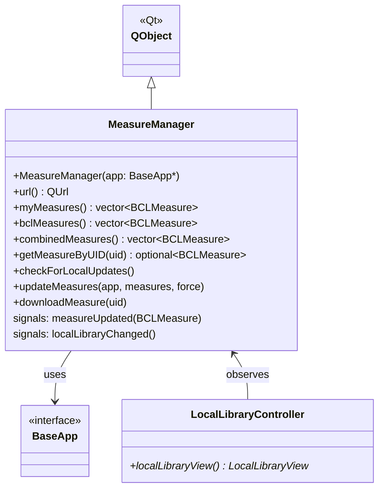

# Class: `MeasureManager`

> **Module:** `shared_gui_components`  
> **Header:** [src/shared_gui_components/MeasureManager.hpp](../../../../src/shared_gui_components/MeasureManager.hpp)  
> **Library doc:** [libraries/shared_gui_components.md](../../libraries/shared_gui_components.md)

## Purpose

`MeasureManager` is the central manager for all OpenStudio Measures available to the application. It:
- Scans the user's `myMeasures` directory and the local BCL cache for available measures
- Deduplicates measures across both locations by UUID (preferring `myMeasures`)
- Checks for newer versions of measures in the project against the local library
- Provides the data source for the `LocalLibraryController` (measure browser)
- Manages the background update workflow for syncing project measures

---

## Class Diagram

---

## Constructor

| Parameter | Type | Description |
|---|---|---|
| `t_app` | `BaseApp*` | The application interface; provides `tempDir()`, `currentModel()`, and UI hooks |

---

## Key Public Methods

| Method | Returns | Description |
|---|---|---|
| `myMeasures()` | `vector<BCLMeasure>` | All measures found in the user's `myMeasures` directory |
| `bclMeasures()` | `vector<BCLMeasure>` | All measures in the local BCL cache |
| `combinedMeasures()` | `vector<BCLMeasure>` | Merged and deduplicated list (myMeasures preferred when UUID collides) |
| `getMeasureByUID(uid)` | `optional<BCLMeasure>` | Looks up a measure by its UUID string |
| `checkForLocalUpdates()` | `void` | Re-scans both measure directories and emits `localLibraryChanged` if anything changed |
| `updateMeasures(app, measures, force)` | `void` | For each measure in the project workflow, checks if a newer version exists locally and optionally updates |
| `downloadMeasure(uid)` | `void` | Downloads a measure from the BCL to the local cache |
| `url()` | `QUrl` | The BCL API base URL |

---

## Qt Signals

| Signal | Arguments | Description |
|---|---|---|
| `measureUpdated` | `BCLMeasure` | Emitted when a measure in the project has been updated to a newer local version |
| `localLibraryChanged` | — | Emitted after a rescan finds changes; triggers `LocalLibraryController` to refresh |

---

## Thread Safety

`MeasureManager` uses a `QMutex` to protect its internal measure index. BCL download network requests are performed on the Qt network thread; completion signals are delivered on the GUI thread via queued connections.

---

## Measure Priority

When the same UUID exists in both `myMeasures` and the BCL cache, `combinedMeasures()` always returns the `myMeasures` copy. This supports the workflow of: download from BCL → customise locally → `myMeasures` version takes precedence.
