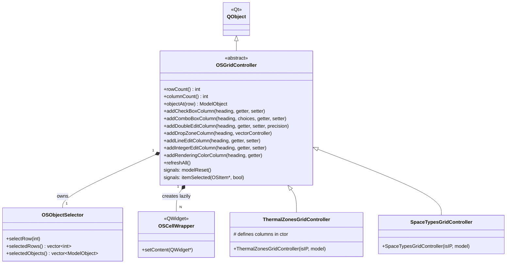

# Class: `OSGridController`

> **Module:** `shared_gui_components`  
> **Header:** [src/shared_gui_components/OSGridController.hpp](../../../../src/shared_gui_components/OSGridController.hpp)  
> **Library doc:** [libraries/shared_gui_components.md](../../libraries/shared_gui_components.md)

## Purpose

`OSGridController` is the abstract base class for all multi-column tabular model views. It provides a declarative column-definition API (`add*Column()` methods) and manages row-object mapping, selection state, and cell widget creation on demand.

Concrete subclasses declare their columns in their constructor by calling the `add*Column()` methods, which the base class uses to render each cell through an `OSCellWrapper`. Data is fetched lazily via `std::function` getters/setters rather than through Qt's model/view.

---

## Class Diagram

---

## Column Definition API

All `add*Column()` methods accept a heading string and typed getter/setter functions:

| Method | Widget type | Getter | Setter |
|---|---|---|---|
| `addCheckBoxColumn` | `OSCheckBox2` | `function<bool(ModelObject)>` | `function<bool(ModelObject, bool)>` |
| `addComboBoxColumn` | `OSComboBox2` | `function<string(ModelObject)>` | `function<bool(ModelObject, string)>` |
| `addDoubleEditColumn` | `OSDoubleEdit2` | `function<optional<double>(ModelObject)>` | `function<bool(ModelObject, double)>` |
| `addDropZoneColumn` | `OSDropZone` | `OSVectorController` subclass | — |
| `addLineEditColumn` | `OSLineEdit2` | `function<string(ModelObject)>` | `function<bool(ModelObject, string)>` |
| `addIntegerEditColumn` | `OSIntegerEdit2` | `function<optional<int>(ModelObject)>` | `function<bool(ModelObject, int)>` |
| `addRenderingColorColumn` | `RenderingColorWidget` | `function<optional<RenderingColor>(ModelObject)>` | — |

### `DataSource` Adapter

Columns can optionally be wrapped in a `DataSource`, which maps a `ModelObject` to a `std::vector<T>` of sub-objects, creating a stacked column to display multiple widgets per row cell (e.g., all space load instances for a space type).

---

## Key Public Methods

| Method | Returns | Description |
|---|---|---|
| `rowCount()` | `int` | Number of data rows (model objects) |
| `columnCount()` | `int` | Number of defined columns |
| `objectAt(row)` | `model::ModelObject` | Returns the model object for the given row |
| `refreshAll()` | `void` | Forces a full re-render of all cells |

---

## Qt Signals

| Signal | Arguments | Description |
|---|---|---|
| `modelReset` | — | Emitted when the underlying object list changes and all rows must be re-generated |
| `itemSelected` | `OSItem*, bool readOnly` | Emitted when a row object is selected; drives the right-column inspector |
