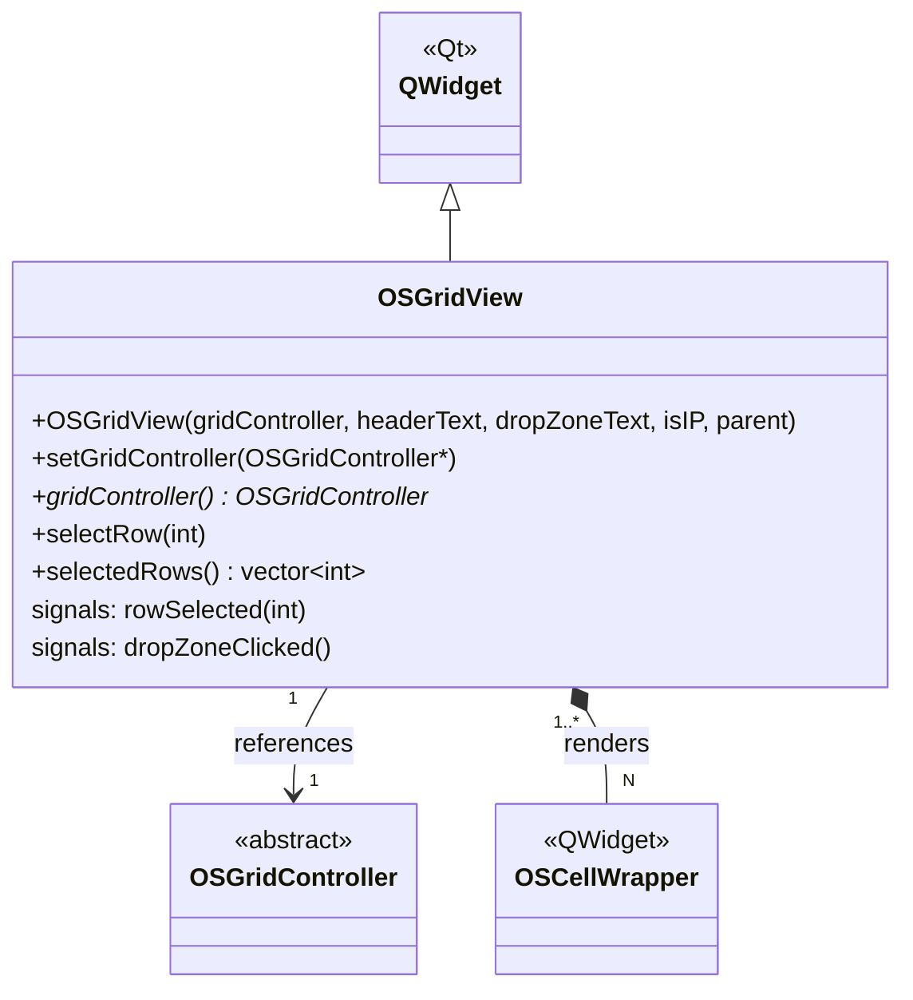

# Class: `OSGridView`

> **Module:** `shared_gui_components`  
> **Header:** [src/shared_gui_components/OSGridView.hpp](../../../../src/shared_gui_components/OSGridView.hpp)  
> **Library doc:** [libraries/shared_gui_components.md](../../libraries/shared_gui_components.md)

## Purpose

`OSGridView` is the `QWidget` that hosts and renders an `OSGridController`. It manages a `QScrollArea` containing a grid of `OSCellWrapper` widgets arranged in rows and columns. It handles row selection highlighting and forwards keyboard navigation events to the controller.

Domain views (e.g., `ThermalZonesGridView`, `SpaceTypesGridView`) typically subclass `OSGridView` or compose it into a larger layout with filter/search bars.

---

## Class Diagram

---

## Constructor

| Parameter | Type | Description |
|---|---|---|
| `gridController` | `OSGridController*` | The controller providing row/column data |
| `headerText` | `QString` | Text shown in the column header row |
| `dropZoneText` | `QString` | Placeholder text for the "add new object" drop zone at the top or bottom |
| `isIP` | `bool` | IP/SI unit display preference |
| `parent` | `QWidget*` | Qt parent |

---

## Key Public Methods

| Method | Returns | Description |
|---|---|---|
| `setGridController(ctrl)` | `void` | Replaces the grid controller and re-renders all cells |
| `gridController()` | `OSGridController*` | The current controller |
| `selectRow(int)` | `void` | Programmatically selects a row and scrolls it into view |
| `selectedRows()` | `vector<int>` | Returns indices of all currently selected rows |

---

## Qt Signals

| Signal | Arguments | Description |
|---|---|---|
| `rowSelected` | `int rowIndex` | Emitted when the user clicks or keyboard-navigates to a row |
| `dropZoneClicked` | — | Emitted when the user clicks the "add new object" drop area |
