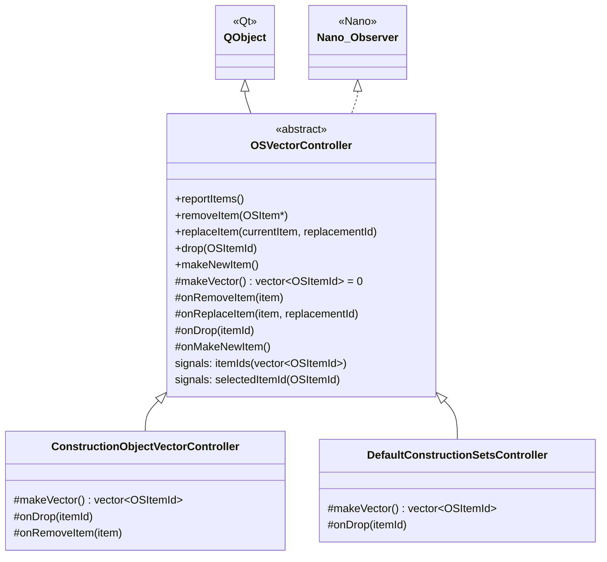

# Class: `OSVectorController`

> **Module:** `shared_gui_components`  
> **Header:** [src/shared_gui_components/OSVectorController.hpp](../../../../src/shared_gui_components/OSVectorController.hpp)  
> **Library doc:** [libraries/shared_gui_components.md](../../libraries/shared_gui_components.md)

## Purpose

`OSVectorController` is the abstract base class for all list/vector controllers in the application. It provides the protocol for managing an ordered list of `OSItemId`s that represent model objects displayed in an `OSItemList` or `OSDropZone` widget.

Concrete subclasses implement `makeVector()` to return the current set of item IDs from the model. The base class handles the scheduling of re-renders (deduped with a mutex) and the routing of user interactions (remove, replace, drop, create) through virtual dispatch.

---

## Class Diagram



---

## Key Public Slots

| Slot | Arguments | Description |
|---|---|---|
| `reportItems()` | — | Triggers `makeVector()` and emits `itemIds` with the result. Calls are deduplicated using a mutex so that rapid model changes only cause one repaint. |
| `removeItem(item)` | `OSItem*` | Called when the user removes an item (clicks the × button); dispatches to `onRemoveItem()` |
| `replaceItem(currentItem, replacementId)` | `OSItem*, OSItemId` | Called when an item is replaced by drag-and-drop; dispatches to `onReplaceItem()` |
| `drop(itemId)` | `OSItemId` | Called when an item is dropped into an associated `OSDropZone`; dispatches to `onDrop()` |
| `makeNewItem()` | — | Called when the user requests a new empty item; dispatches to `onMakeNewItem()` |

---

## Qt Signals

| Signal | Arguments | Description |
|---|---|---|
| `itemIds` | `vector<OSItemId>` | Emitted by `reportItems()` with the current ordered list of item IDs |
| `selectedItemId` | `OSItemId` | Emitted when the controller wants to notify listeners of a newly selected item |

---

## Protected Virtual Methods (override points)

| Method | Description |
|---|---|
| `makeVector()` | **Must override.** Return the current ordered list of `OSItemId`s from the model. |
| `onRemoveItem(item)` | Called when the user removes an item. Default: no-op. Override to delete from model. |
| `onReplaceItem(item, replacementId)` | Called when an item is replaced. Default: removes old, drops new. |
| `onDrop(itemId)` | Called when an item is dropped. Default: no-op. Override to insert into model. |
| `onMakeNewItem()` | Called to create a new blank item. Default: no-op. |

---

## Usage Pattern

```cpp
class MyController : public OSVectorController {
protected:
  std::vector<OSItemId> makeVector() override {
    // Return OSItemIds for all objects of interest in the model
    std::vector<OSItemId> ids;
    for (auto& obj : m_model.getModelObjects<MyType>()) {
      ids.push_back(modelObjectToItemId(obj, false));
    }
    return ids;
  }

  void onDrop(const OSItemId& itemId) override {
    // Handle drop: add the dropped object to the model collection
  }
};
```

The controller is paired with an `OSDropZone` or `OSItemList` widget, which connects to `itemIds` to re-render whenever the model changes.
