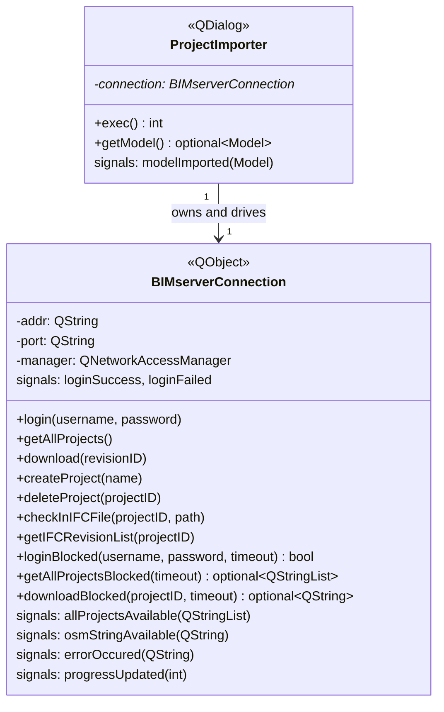
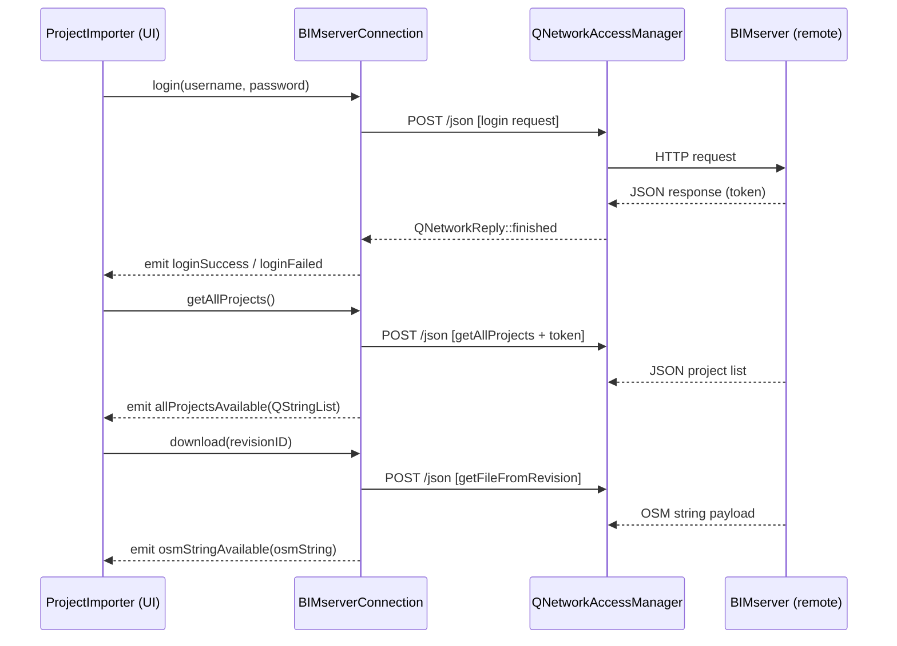

# Library: `bimserver` — BIMserver Integration

> **Source:** `src/bimserver/`  
> **CMake target:** `openstudio_bimserver`  
> **Back to:** [Architecture Overview](../architecture.md)

## Purpose

The `bimserver` module provides optional integration with a [BIMserver](http://bimserver.org/) instance — an open-source BIM server that stores and versions IFC building models.

It enables users to:
1. Log on to a BIMserver instance
2. Browse available projects
3. Select a project revision and download it as an OpenStudio Model (`.osm`)
4. Check in new or updated IFC files from local disk

The module offers both **non-blocking (async)** and **blocking** APIs for all operations, allowing it to be used from GUI code (non-blocking + signals) and scripted CLI-style workflows (blocking with timeout).

---

## Key Classes

---

## Communication Protocol

BIMserver exposes a JSON-over-HTTP API. `BIMserverConnection` uses Qt Network (`QNetworkAccessManager`) to issue HTTP POST requests:

---

## Blocking vs. Non-Blocking API

| Non-blocking (async) | Blocking |
|---|---|
| `login(username, password)` → `loginSuccess`/`loginFailed` | `loginBlocked(username, password, timeout) → bool` |
| `getAllProjects()` → `allProjectsAvailable(QStringList)` | `getAllProjectsBlocked(timeout) → optional<QStringList>` |
| `download(revisionID)` → `osmStringAvailable(QString)` | `downloadBlocked(projectID, timeout) → optional<QString>` |

Blocking variants spin a `QEventLoop` with a `QTimer` for the timeout, making them usable in non-GUI contexts.

---

## External Dependencies

| Dependency | Usage |
|---|---|
| **Qt 6** (`QtNetwork`, `QtCore`, `QtWidgets`) | HTTP client, JSON parsing, dialog UI |
| **OpenStudio SDK** | Parsed from OSM string returned by BIMserver |
| **Boost** | `optional` |

---

## Internal Dependencies

| Module | Usage |
|---|---|
| `openstudio_qt_utils` | `Application` singleton, `Utilities` (string/UUID/path conversions), `QMetaTypes` (SDK metatype registration) |

---

## Patterns & Conventions

- **Signal-based error handling** — errors from network operations surface via `errorOccured(QString)` rather than exceptions.
- **Progress reporting** — `progressUpdated(int)` (0–100) for long-running IFC check-in operations.
- **`boost::optional` returns** — blocking APIs return `boost::none` on timeout/failure.

---

## Key Classes

Class-level documentation is in the corresponding header files under [`src/bimserver/`](../../../src/bimserver/).
