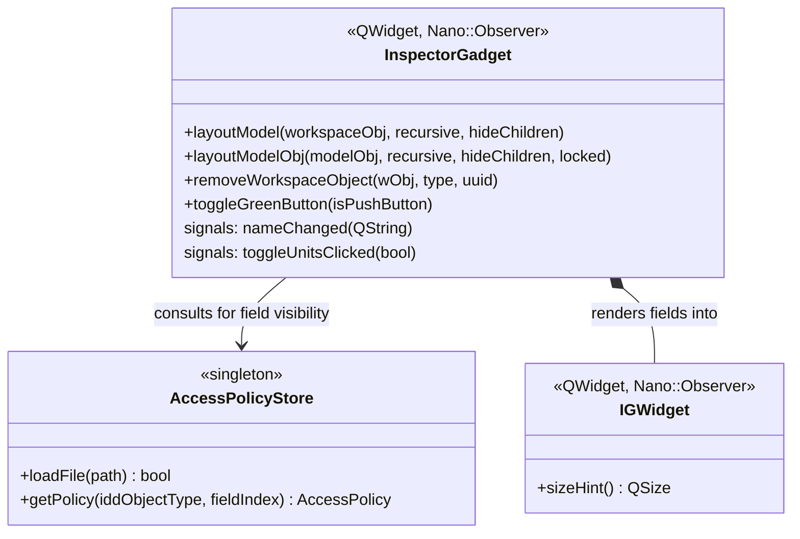

# Library: `model_editor` — Generic Model Inspector

> **Source:** `src/model_editor/`  
> **CMake target:** `openstudio_modeleditor`  
> **Back to:** [Architecture Overview](../architecture.md)

## Purpose

`model_editor` provides a generic, IDD schema-driven inspector for any OpenStudio `ModelObject` or `WorkspaceObject`. Rather than hand-coding a bespoke widget for every object type, it interrogates the object's IDD definition at runtime and generates the appropriate input controls (spinboxes, comboboxes, labels) automatically.

It is used:
- By `openstudio_lib` for the right-column object inspector

---

## Key Classes

| Class | File | Description |
|---|---|---|
| `InspectorGadget` | [InspectorGadget.hpp](../../../src/model_editor/InspectorGadget.hpp) | Core widget. Accepts any `WorkspaceObject` or `ModelObject` and auto-generates input controls from the IDD field definitions. |
| `IGWidget` | [InspectorGadget.hpp](../../../src/model_editor/InspectorGadget.hpp) | Lightweight `QWidget` / `Nano::Observer` base used as the scroll area content for the generated controls. |
| `AccessPolicyStore` | [AccessPolicyStore.hpp](../../../src/model_editor/AccessPolicyStore.hpp) | Singleton that reads an XML policy file to determine whether each IDD field is `FREE` (editable), `LOCKED` (read-only), or hidden. |
| `BridgeClasses` | [BridgeClasses.hpp](../../../src/model_editor/BridgeClasses.hpp) | Adapts OpenStudio nano signals to Qt slots so workspace change notifications reach Qt-connected widgets. |

---

## Field Rendering Rules

`InspectorGadget` generates different Qt widgets for each IDD field type based on the `AccessPolicyStore` policy:

| IDD Field Type | `FREE` policy | `LOCKED` policy |
|---|---|---|
| Real | `QDoubleSpinBox` | `QLabel` |
| Integer | `QSpinBox` | `QLabel` |
| Alpha / String | `QLineEdit` | `QLabel` |
| Choice | `IGComboBox` (custom) | `QLabel` |
| Boolean | `QCheckBox` | `QLabel` |
| Object reference | `QLineEdit` + lookup button | `QLabel` |

---

## External Dependencies

| Dependency | Usage |
|---|---|
| **Qt 6** (`QtWidgets`, `QtCore`) | Widget rendering, event handling |
| **OpenStudio SDK** (`WorkspaceObject`, `ModelObject`, `IddObject`, `IddField`) | IDD schema introspection for field type/name/range |
| **Nano signal-slot** | `Nano::Observer` mixin for low-overhead workspace change notifications |

---

## Internal Dependencies

| Module | Usage |
|---|---|
| `openstudio_qt_utils` | `Application` singleton, `Utilities` (string/UUID/path conversions), `QMetaTypes` (SDK metatype registration), `OSProgressBar` |

---

## Patterns & Conventions

- **IDD-driven layout** — the widget layout is entirely data-driven from the OpenStudio IDD schema, requiring no code changes when new object types are added to the SDK.
- **Policy file** — `AccessPolicyStore` reads an XML file at startup. To lock or hide a field for a specific object type, edit the policy file rather than the widget code.
- **Nano signals (not Qt signals)** — `InspectorGadget` and `IGWidget` use `Nano::Observer` (a lightweight signal-slot system that does not require `QObject`) for model change notifications, minimising MOC overhead.

---

## Key Classes

Class-level documentation is in the corresponding header files under [`src/model_editor/`](../../../src/model_editor/).
