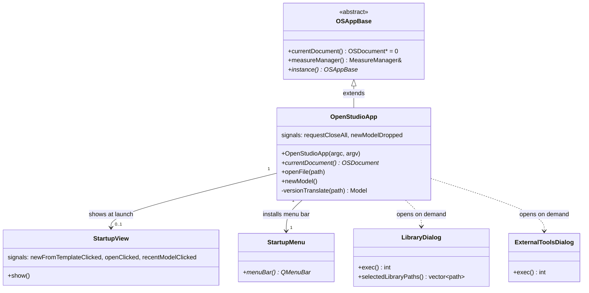

# Library: `openstudio_app` — Application Entry Point

> **Source:** `src/openstudio_app/`  
> **CMake target:** `OpenStudioApp` (executable)  
> **Back to:** [Architecture Overview](../architecture.md)

## Purpose

`openstudio_app` is the top-level executable module. It owns the `main()` entry point, constructs the `OSAppBase`-derived `OpenStudioApp` instance, manages the Qt application lifecycle, and provides the startup experience (splash screen, library selection, version migration dialogs) shown before an `OSDocument` is opened.

This module is intentionally thin: all substantive GUI logic lives in `openstudio_lib`. `openstudio_app` acts as the glue that wires together the document model, the main window, and the startup flow.

---

## Key Classes

| Class | File | Description |
|---|---|---|
| `OpenStudioApp` | [OpenStudioApp.hpp](../../../src/openstudio_app/OpenStudioApp.hpp) | Main application object. Extends `OSAppBase` (which extends `QApplication`). Manages document lifecycle, version translation, and initial template models. |
| `StartupView` | [StartupView.hpp](../../../src/openstudio_app/StartupView.hpp) | Splash/welcome screen shown before any document is open. Provides New/Open/Recent actions. |
| `StartupMenu` | [StartupMenu.hpp](../../../src/openstudio_app/StartupMenu.hpp) | Minimal menu bar shown during the startup screen (no document-specific items). |
| `LibraryDialog` | [LibraryDialog.hpp](../../../src/openstudio_app/LibraryDialog.hpp) | Dialog allowing users to select component library `.osm` files to load alongside the project. |
| `ExternalToolsDialog` | [ExternalToolsDialog.hpp](../../../src/openstudio_app/ExternalToolsDialog.hpp) | Dialog for configuring paths to external tools (EnergyPlus, Radiance, etc.). |

---

## External Dependencies

| Dependency | Usage |
|---|---|
| **Qt 6** (`QtWidgets`, `QtCore`, `QApplication`, `QProcess`, `QFutureWatcher`, `QTranslator`) | GUI event loop, async version translation, i18n |
| **OpenStudio SDK** (`openstudio/model/Model.hpp`, HVAC headers, `osversion/VersionTranslator`) | Model construction, version migration from older `.osm` files |
| **Boost** | `optional`, path utilities |

---

## Internal Dependencies

| Module | Usage |
|---|---|
| `openstudio_lib` | `OSAppBase`, `OSDocument`, `MainWindow` — instantiated here; transitively pulls in `shared_gui_components`, `model_editor`, and `openstudio_qt_utils` |
| `openstudio_bimserver` | BIMserver import/export integration |

---

## Patterns & Conventions

- **Singleton via `OSAppBase::instance()`** — `OpenStudioApp` registers itself so any code can retrieve the app via `OSAppBase::instance()`.
- **Version translation** — when opening a `.osm` file from a prior OpenStudio version, the app runs `osversion::VersionTranslator` asynchronously (via `QFutureWatcher`) before displaying the document.
- **Initial template models** — several pre-built HVAC templates (VAV, DOAS, packaged RTU, etc.) are embedded; the relevant model headers are included directly in `OpenStudioApp.hpp` to make their HVAC component types available.
- **`TouchEater`** — a `QObject` event filter that suppresses touch events on Windows to avoid accidental UI manipulation with touch screens.

---

## Class Documentation

- [OpenStudioApp](../classes/openstudio_app/OpenStudioApp.md)
- [StartupView](../classes/openstudio_app/StartupView.md)
