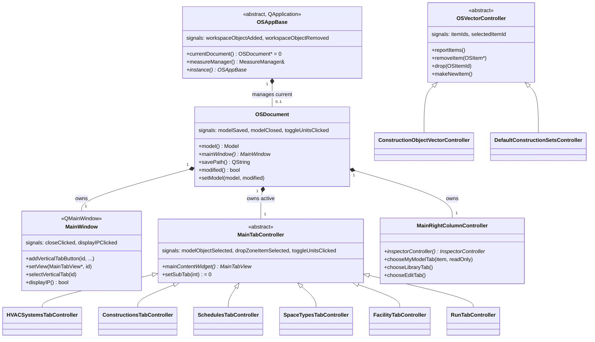

# Library: `openstudio_lib` — Main GUI Library

> **Source:** `src/openstudio_lib/`  
> **CMake target:** `openstudio_lib`  
> **Back to:** [Architecture Overview](../architecture.md)

## Purpose

`openstudio_lib` is the largest module (~200+ source files). It implements the complete building model editing GUI: every tab, every inspector view, every drag-and-drop list, and the geometry editor. It also defines the shared base types (`OSAppBase`, `OSDocument`, `MainWindow`) that the executable and the SketchUp plugin both build upon.

The module follows a consistent **Controller / View / Inspector triad** per domain: a controller manages data access and inter-widget coordination, a tab view provides the domain's layout, and inspector widgets display the selected object's properties.

---

## Key Classes Overview

---

## Domain Modules Within `openstudio_lib`

| Domain | Key Controller | Key View | Notes |
|---|---|---|---|
| Application shell | `OSAppBase`, `OSDocument` | `MainWindow` | Foundation for all tabs |
| Geometry editor | `GeometryEditorController` | `GeometryEditorView` | Qt WebEngine + JS bridge |
| Geometry preview | `GeometryPreviewController` | `GeometryPreviewView` | Read-only 3D preview |
| HVAC Systems | `HVACSystemsTabController`, `HVACSystemsController` | `HVACSystemsTabView`, `HVACSystemsView` | Loop/service water/VRF scenes |
| Refrigeration | `RefrigerationController`, `RefrigerationGridController` | `RefrigerationView`, `RefrigerationScene` | Custom QGraphicsScene |
| Constructions | `ConstructionsTabController`, `ConstructionsController` | `ConstructionsTabView`, `ConstructionsView` | Many derived inspector views |
| Materials | `MaterialsController` | `MaterialsView` | Per-material inspector views |
| Loads | `LoadsController` | `LoadsView` | Equipment, people, lights inspectors |
| Schedules | `SchedulesTabController`, `SchedulesController` | `SchedulesTabView`, `SchedulesDayView` | Day schedule chart editor |
| Space Types | `SpaceTypesController` | `SpaceTypesGridView`, `SpaceTypeInspectorView` | Grid view |
| Thermal Zones | `ThermalZonesController` | `ThermalZonesGridView` | Grid view |
| Spaces | `SpacesTabController` | Multiple `Spaces*GridView` | Surfaces, loads, shading sub-tabs |
| Facility | `FacilityTabController` | `FacilityStoriesGridView`, `FacilityShadingGridView` | Building stories, shading |
| Simulation Settings | `SimSettingsTabController` | `SimSettingsTabView`, `DesignDayGridView` | Run period, design days |
| Run | `RunTabController` | `RunTabView` | Triggers EnergyPlus |
| Results | `ResultsTabController` | `ResultsTabView` | Post-run output charts |
| Variables | `VariablesTabController` | `VariablesTabView` | EnergyPlus output variables |
| Measures/Scripts | `ScriptsTabController` | `ScriptsTabView` | Measure workflow |
| Utility Bills | `UtilityBillsController` | `UtilityBillsView` | Calibration data |
| Inspector (generic) | `InspectorController` | `InspectorView` | Right-column inspector |
| BCL | — | — | `BCLComponentItem` |

---

## Reusable Widget Primitives

| Class | Description |
|---|---|
| `OSItem` | Base class for all draggable/selectable model object items |
| `OSDropZone` | Widget that accepts model object drops |
| `OSItemList` / `OSCollapsibleItem` | Container widgets for ordered lists of `OSItem`s |
| `OSVectorController` | Abstract base for list controllers backed by model vectors |
| `ModelObjectListView` | Generic list view displaying any collection of model objects |
| `ModelObjectTreeWidget` | Generic tree view for hierarchical model data |
| `OSWebEnginePage` | `QWebEnginePage` subclass for the geometry JS bridge |
| `RenderingColorWidget` | Color picker for object rendering colors |
| `IconLibrary` | Singleton cache of domain icons keyed by IDD object type |

---

## External Dependencies

| Dependency | Usage |
|---|---|
| **Qt 6** (`QtWidgets`, `QtWebEngineWidgets`, `QtCharts`, `QtNetwork`, `QtSvg`) | All GUI rendering, WebEngine geometry view, charts for results |
| **OpenStudio SDK** | Model objects, HVAC components, workspace I/O, analytics |
| **Boost** | `optional`, `shared_ptr`, `smart_ptr` |

---

## Internal Dependencies

| Module | Usage |
|---|---|
| `shared_gui_components` | Grid system, form widgets, `MeasureManager`, `BCLMeasureDialog`, `UserSettings` |
| `model_editor` | `InspectorGadget`, `QMetaTypes` (for `OSItemId` metatype registration) |
| `openstudio_qt_utils` | `Application` singleton, `Utilities` (string/UUID/path conversions) |

---

## Patterns & Conventions

- **MVC triad** — every domain has a `*TabController`, a `*TabView`, and one or more `*InspectorView` classes.
- **`OSQObjectController`** — `OSDocument` and most controllers extend `OSQObjectController`, which provides a thread-safe `QObject` parent management pattern.
- **`OPENSTUIDO_API` macro** — applied to classes exported from `openstudio_lib.dll` on Windows.
- **Analytics** — `AnalyticsHelper` sends anonymized usage pings (configurable via `ANALYTICS_API_SECRET`/`ANALYTICS_MEASUREMENT_ID` build-time secrets).

---

## Class Documentation

- [OSAppBase](../classes/openstudio_lib/OSAppBase.md)
- [OSDocument](../classes/openstudio_lib/OSDocument.md)
- [MainWindow](../classes/openstudio_lib/MainWindow.md)
- [MainTabController](../classes/openstudio_lib/MainTabController.md)
- [MainRightColumnController](../classes/openstudio_lib/MainRightColumnController.md)
- [OSVectorController](../classes/openstudio_lib/OSVectorController.md)
- [InspectorController](../classes/openstudio_lib/InspectorController.md)
- [ModelObjectListView](../classes/openstudio_lib/ModelObjectListView.md)
- [OSItem](../classes/openstudio_lib/OSItem.md)
- [OSDropZone](../classes/openstudio_lib/OSDropZone.md)
- [HVACSystemsController](../classes/openstudio_lib/HVACSystemsController.md)
- [HVACSystemsView](../classes/openstudio_lib/HVACSystemsView.md)
- [GeometryEditorController](../classes/openstudio_lib/GeometryEditorController.md)
- [ConstructionsController](../classes/openstudio_lib/ConstructionsController.md)
- [MaterialsController](../classes/openstudio_lib/MaterialsController.md)
- [SchedulesController](../classes/openstudio_lib/SchedulesController.md)
- [SpaceTypesController](../classes/openstudio_lib/SpaceTypesController.md)
- [ThermalZonesController](../classes/openstudio_lib/ThermalZonesController.md)
- [RunTabController](../classes/openstudio_lib/RunTabController.md)
- [ResultsTabController](../classes/openstudio_lib/ResultsTabController.md)
- [OSWebEnginePage](../classes/openstudio_lib/OSWebEnginePage.md)
