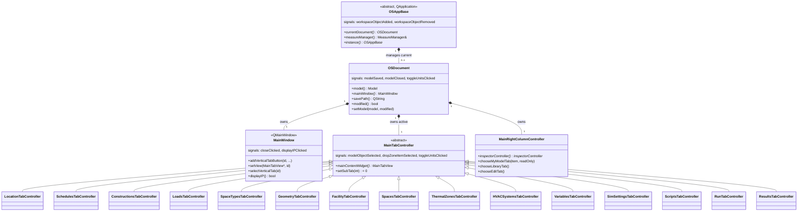

# Library: `openstudio_lib` — Main GUI Library

> **Source:** `src/openstudio_lib/`  
> **CMake target:** `openstudio_lib`  
> **Back to:** [Architecture Overview](../architecture.md)

## Purpose

`openstudio_lib` is the largest module (~200+ source files). It implements the complete building model editing GUI: every tab, every inspector view, every drag-and-drop list, and the geometry editor. It also defines the shared base types (`OSAppBase`, `OSDocument`, `MainWindow`) that the OpenStudioApp executable builds upon.

The module follows a consistent **Controller / View / Inspector triad** per domain. The **Model** layer is the OpenStudio SDK (`openstudio::model::Model` and its `ModelObject` children) — controllers read from and mutate these SDK objects directly, never through an intermediate layer. The controller manages data access and inter-widget coordination, the tab view provides the domain's primary layout, and inspector widgets display the selected object's editable properties.

---

## Key Classes Overview

---

## Domain Modules Within `openstudio_lib`

| Domain (VerticalTabID) | Key Controller | Key View | Sub-tabs |
|---|---|---|---|
| Application shell | `OSAppBase`, `OSDocument` | `MainWindow` | — |
| Site / Location (0) | `LocationTabController` | `LocationTabView` | Weather File & Design Days · Life Cycle Costs · Utility Bills · Ground Temperatures |
| Schedules (1) | `SchedulesTabController`, `SchedulesController` | `SchedulesTabView`, `SchedulesDayView` | Schedule Sets · Schedules · Other Schedules |
| Constructions (2) | `ConstructionsTabController`, `ConstructionsController` | `ConstructionsTabView`, `ConstructionsView` | Construction Sets · Constructions · Materials |
| Loads (3) | `LoadsTabController`, `LoadsController` | `LoadsView` | *(single grid view)* |
| Space Types (4) | `SpaceTypesTabController`, `SpaceTypesController` | `SpaceTypesGridView`, `SpaceTypeInspectorView` | *(single grid view)* |
| Geometry (5) | `GeometryTabController` | — | 3D View · Editor |
| Facility (6) | `FacilityTabController` | `FacilityTabView` | Building · Stories · Shading · Exterior Equipment |
| Spaces (7) | `SpacesTabController` | Multiple `Spaces*GridView` | Properties · Loads · Surfaces · Subsurfaces · Interior Partitions · Shading |
| Thermal Zones (8) | `ThermalZonesTabController`, `ThermalZonesController` | `ThermalZonesGridView` | *(single grid view)* |
| HVAC Systems (9) | `HVACSystemsTabController`, `HVACSystemsController` | `HVACSystemsTabView`, `HVACSystemsView` | *(single view; `RefrigerationController` accessible via HVAC scene)* |
| Output Variables (10) | `VariablesTabController` | `VariablesTabView` | *(single view)* |
| Simulation Settings (11) | `SimSettingsTabController` | `SimSettingsTabView`, `DesignDayGridView` | *(single view)* |
| Measures/Scripts (12) | `ScriptsTabController` | `ScriptsTabView` | *(single view)* |
| Run (13) | `RunTabController` | `RunTabView` | *(single view)* |
| Results (14) | `ResultsTabController` | `ResultsTabView` | *(single view)* |
| Inspector (generic) | `InspectorController` | `InspectorView` | — |
| BCL | — | — | — |

---

## Reusable Widget Primitives

| Class | Description |
|---|---|
| `OSItemList` / `OSCollapsibleItem` | Container widgets for ordered lists of `OSItem`s |
| `ModelObjectListView` | Generic list view displaying any collection of model objects |
| `OSWebEnginePage` | `QWebEnginePage` subclass for the geometry JS bridge |

---

## External Dependencies

| Dependency | Usage |
|---|---|
| **Qt 6** (`QtWidgets`, `QtWebEngineWidgets`, `QtCharts`, `QtNetwork`, `QtSvg`) | All GUI rendering, WebEngine geometry view, charts for results |
| **OpenStudio SDK** | Model objects, HVAC components, workspace I/O, analytics |
| **Boost** | `optional`, `shared_ptr`, `smart_ptr` |

---

## Internal Dependencies

| Module | Usage |
|---|---|
| `shared_gui_components` | Grid system, form widgets, `MeasureManager`, `BCLMeasureDialog`, `UserSettings`, `OSVectorController`, `IconLibrary` |
| `model_editor` | `InspectorGadget`, `AccessPolicyStore` |
| `openstudio_qt_utils` | `Application` singleton, `Utilities` (string/UUID/path conversions), `QMetaTypes` (SDK metatype registration) |

---

## Patterns & Conventions

- **Master-detail MVC** — every domain has a `*TabController` (controller), a `*TabView` (master), and one or more `*InspectorView` classes (detail).
- **`OSQObjectController`** — `OSDocument` and most controllers extend `OSQObjectController`, which provides a thread-safe `QObject` parent management pattern.
- **Static linking** — all internal libraries are built `STATIC`; no DLL export macros are needed.
- **Analytics** — `AnalyticsHelper` sends anonymized usage pings (configurable via `ANALYTICS_API_SECRET`/`ANALYTICS_MEASUREMENT_ID` build-time secrets).

---

## Key Classes

Class-level documentation is in the corresponding header files under [`src/openstudio_lib/`](../../../src/openstudio_lib/).
