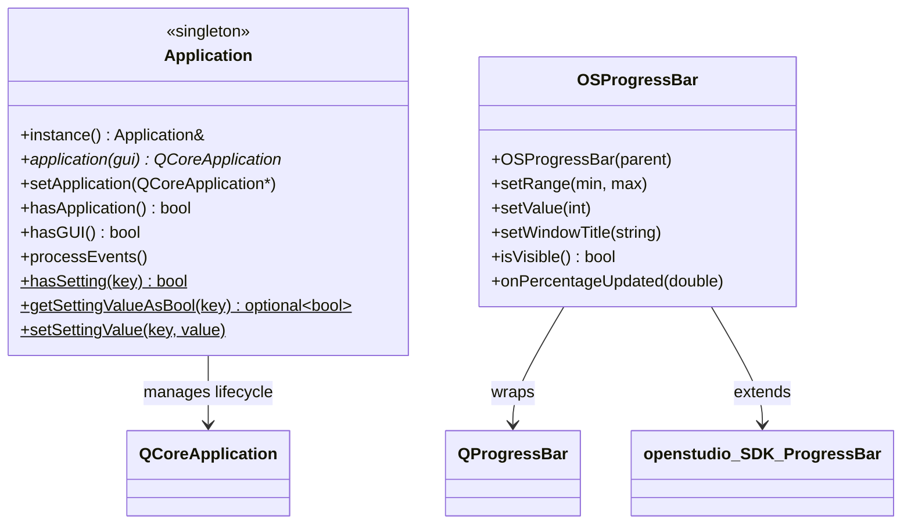

# Library: `openstudio_qt_utils` — Qt/OpenStudio Primitives

> **Source:** `src/openstudio_qt_utils/`  
> **CMake target:** `openstudio_qt_utils`  
> **Back to:** [Architecture Overview](../architecture.md)

## Purpose

`openstudio_qt_utils` is the lowest-level Qt-aware library in the application. It contains utilities that are needed by both `shared_gui_components` and `model_editor`, but which have no dependency on either. Placing them here breaks the old cycle where `shared_gui_components` was forced to link `model_editor` just to access string conversion helpers.

Key responsibilities:
- **String / UUID / path conversions** — bidirectional translation between `std::string`, `std::wstring`, `openstudio::path`, `openstudio::UUID`, and `QString`
- **Application singleton** — manages the `QCoreApplication` / `QApplication` lifecycle and provides a cross-module `QSettings` accessor
- **Qt metatype registration** — `Q_DECLARE_METATYPE` and `qRegisterMetaType` calls for OpenStudio SDK types used in queued signals/slots (`IddObjectType`, `UUID`, `Quantity`, etc.)
- **Progress bar widget** — `OSProgressBar`, a thin Qt wrapper around `openstudio::ProgressBar` for displaying SDK-driven progress in a `QProgressBar`

---

## Key Classes



---

## Files

| File | Description |
|---|---|
| `OpenStudioQtUtilsAPI.hpp` | DLL export macro (`OPENSTUDIOQTUTILS_API`) for Windows shared library symbol visibility |
| `Application.hpp/cpp` | `openstudio::Application` singleton — `QApplication` lifecycle management and `QSettings` read/write |
| `Utilities.hpp/cpp` | Free functions for converting between `QString`, `std::string`, `std::wstring`, `openstudio::path`, and `openstudio::UUID` |
| `QMetaTypes.hpp/cpp` | `Q_DECLARE_METATYPE` declarations and `qRegisterMetaType` calls for SDK types used in queued signal/slot connections |
| `OSProgressBar.hpp/cpp` | `OSProgressBar` — wraps `QProgressBar` and implements the `openstudio::ProgressBar` interface |

---

## Key API

### Utilities

```cpp
namespace openstudio {
  std::string   toString(const QString& q);
  std::wstring  toWString(const QString& q);
  QString       toQString(const std::string& s);
  QString       toQString(const std::wstring& w);
  QString       toQString(const UUID& uuid);
  QString       toQString(const path& p);
  UUID          toUUID(const QString& str);
  path          toPath(const QString& q);
}
```

### Application

```cpp
namespace openstudio {
  // Retrieve (or lazily create) the QApplication/QCoreApplication
  QCoreApplication* Application::instance().application(bool gui = true);

  // Wrap an existing QApplication created by a host (e.g. SketchUp)
  Application::instance().setApplication(QCoreApplication*);

  // Cross-module QSettings access
  Application::hasSetting(const std::string& key);
  Application::getSettingValueAsBool(const std::string& key);   // → boost::optional<bool>
  Application::getSettingValueAsInt(const std::string& key);    // → boost::optional<int>
  Application::getSettingValueAsDouble(const std::string& key); // → boost::optional<double>
  Application::getSettingValueAsString(const std::string& key); // → boost::optional<std::string>
  Application::setSettingValue(const std::string& key, T value);
}
```

### Metatypes registered

| Type | Registered name |
|---|---|
| `openstudio::IddObjectType` | `"openstudio::IddObjectType"` |
| `openstudio::IddFileType` | `"openstudio::IddFileType"` |
| `openstudio::UUID` | `"openstudio::UUID"` |
| `std::string` | `"std::string"` |
| `std::vector<std::string>` | `"std::vector<std::string>"` |
| `boost::optional<double/unsigned/int/std::string>` | respective names |
| `openstudio::Quantity` | `"openstudio::Quantity"` |
| `openstudio::OSOptionalQuantity` | `"openstudio::OSOptionalQuantity"` |
| `std::shared_ptr<WorkspaceObject_Impl>` | _(anonymous)_ |

> **Note:** `OSItemId` and `std::vector<OSItemId>` are registered in `shared_gui_components/OSGridController.cpp` (via anonymous-namespace statics), since `OSItemId` is defined in `shared_gui_components` and sits above this library in the dependency graph.

---

## External Dependencies

| Dependency | Usage |
|---|---|
| **Qt 6** (`QtWidgets`, `QtCore`) | `QApplication`, `QCoreApplication`, `QSettings`, `QString`, `QProgressBar`, metatype system |
| **OpenStudio SDK** (`utilities/core`, `utilities/idd`, `utilities/units`, `utilities/idf`, `utilities/plot`) | `UUID`, `path`, `IddObjectType`, `Quantity`, `WorkspaceObject_Impl`, `ProgressBar` |
| **Boost** | `boost::optional` in `Application` settings API |

---

## Internal Dependencies

| Module | Usage |
|---|---|
| `openstudioapp_utilities` | `getOpenStudioModuleDirectory()` used by `Application` to configure Qt plugin search paths |

---

## Patterns & Conventions

- **Singleton via local static** — `Application::instance()` uses a function-local `static Application` for thread-safe lazy initialisation (C++11 magic statics).
- **Lazy `QApplication` creation** — `application(bool gui)` creates a headless `QCoreApplication` or full `QApplication` only if no `QCoreApplication::instance()` already exists, making it safe to call from both GUI and CLI contexts.
- **Global metatype registration via namespace-scope statics** — the `int __xxx_type = qRegisterMetaType<T>(...)` variables in `QMetaTypes.cpp` run at shared library load time, ensuring types are registered before any signal/slot connection is made.
